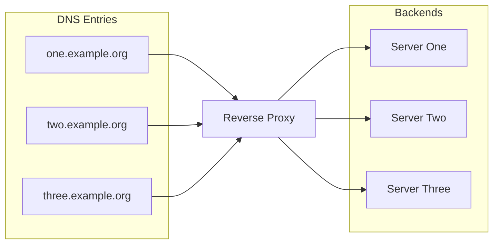

---

## 🖥️ Why bother?

Automating DNS record creation sounds fancy, sounds cool even, but what does it actually get you?

When you're running a [Kubernetes](https://kubernetes.io) cluster, one of the tools you really can't do without is the [ingress controller](https://kubernetes.io/docs/concepts/services-networking/ingress-controllers/). It acts as a [reverse proxy](https://fr.wikipedia.org/wiki/Proxy_inverse), which means it's the one deciding where incoming [HTTP/S](https://fr.wikipedia.org/wiki/Hypertext_Transfer_Protocol) traffic actually goes.




*Ok, so if my reverse proxy already redirects traffic to the right application based on the DNS entry, why not just use a [wildcard](https://en.wikipedia.org/wiki/Wildcard_DNS_record)?*

Great question! And it happens to have a pretty simple answer: security and granular control.

| Criteria                      | Wildcard DNS                          | Automatic DNS record creation                 |
|------------------------------|-------------------------------------|----------------------------------------------------|
| **Setup simplicity** | Very simple, one entry covers everything | Requires a system to create each entry individually |
| **Granular control**        | Low, every subdomain points to the same place | High, each subdomain is precisely defined |
| **Security**                   | Risk of subdomain takeover and loss of control | Lower risk, each entry is deliberately created |
| **SSL certificate management** | A wildcard certificate is often needed | Individual or automated certificates (e.g. Let's Encrypt) |
| **Flexibility**                | Low, hard to route subdomains differently | Very flexible, each subdomain can be routed to a different service |
| **Error detection**        | Trickier, misspelled subdomains can still get a response | Easier, a missing entry signals an error or an invalid subdomain |
| **Maintenance**                | Low maintenance required       | Requires a system to manage and clean up entries |
| **Scalability**                | Very scalable (one record covers everything) | Potentially less scalable, depends on the automation solution |

In my case, I want to cut down on unnecessary requests and shrink my attack surface.

See, when you pair a **wildcard DNS** entry with an **Ingress Controller** like the [Nginx Ingress Controller](https://docs.nginx.com/nginx-ingress-controller/) or even a [Gateway API](https://gateway-api.sigs.k8s.io/), if no service is routed for `one.example.org`, say,
the controller still answers! Which needlessly widens your attack surface and can generate extra requests from bots or malicious actors.

## 🔧 The setup:

- A **Kubernetes** cluster: here, the one I run for [Retake](https://retake.fr).
- A domain name: `retake.fr`
- [Cloudflare](https://cloudflare.com): as the DNS provider.
- **Ingress Nginx Controller**: as the **Ingress Controller**
- [External DNS](https://kubernetes-sigs.github.io/external-dns/latest/): the magic tool that manages entries automatically

## ⚙️ Setting it up:

Alright, let's get into it.

First off, I want to point out that **External DNS** supports every one of the following DNS providers:

- [Google Cloud DNS](https://cloud.google.com/dns/docs/)
- [AWS Route 53](https://aws.amazon.com/route53/)
- [AWS Cloud Map](https://docs.aws.amazon.com/cloud-map/)
- [AzureDNS](https://azure.microsoft.com/en-us/services/dns)
- [Civo](https://www.civo.com)
- [CloudFlare](https://www.cloudflare.com/dns)
- [DigitalOcean](https://www.digitalocean.com/products/networking)
- [DNSimple](https://dnsimple.com/)
- [PowerDNS](https://www.powerdns.com/)
- [CoreDNS](https://coredns.io/)
- [Exoscale](https://www.exoscale.com/dns/)
- [Oracle Cloud Infrastructure DNS](https://docs.cloud.oracle.com/iaas/Content/DNS/Concepts/dnszonemanagement.htm)
- [Linode DNS](https://www.linode.com/docs/networking/dns/)
- [RFC2136](https://tools.ietf.org/html/rfc2136)
- [NS1](https://ns1.com/)
- [TransIP](https://www.transip.eu/domain-name/)
- [OVHcloud](https://www.ovhcloud.com)
- [Scaleway](https://www.scaleway.com)
- [Akamai Edge DNS](https://learn.akamai.com/en-us/products/cloud_security/edge_dns.html)
- [GoDaddy](https://www.godaddy.com)
- [Gandi](https://www.gandi.net)
- [IBM Cloud DNS](https://www.ibm.com/cloud/dns)
- [Plural](https://www.plural.sh/)
- [Pi-hole](https://pi-hole.net/)
- [Alibaba Cloud DNS](https://www.alibabacloud.com/help/en/dns)

> P.S. This list comes straight from the [official docs](https://github.com/kubernetes-sigs/external-dns/blob/master/README.md)

I've been working exclusively with **Cloudflare** for two years now. It's fast, it's free, the API is genuinely intuitive, and the free-tier features cover pretty much everything you'd want.

Once you're logged into your **Cloudflare** account, head to `Profile` > `API Token` and create a token with the following configuration:


Save it and set it aside for now.

Now it's time to deploy **External DNS**:

First, create a namespace:

```bash
kubectl create namespace external-dns
```

Create a secret:

```bash
kubectl create secret -n external-dns generic cloudflare-api-key --from-literal=apiKey=<API_KEY> --from-literal=email=<EMAIL>
```

Add the [helm](https://helm.sh) repository:

```bash
helm repo add external-dns https://kubernetes-sigs.github.io/external-dns/
helm repo update
```

Prepare your values:

```yaml
# values.yml
provider:
  name: cloudflare
env:
  - name: CF_API_KEY
    valueFrom:
      secretKeyRef:
        name: cloudflare-api-key
        key: apiKey
  - name: CF_API_EMAIL
    valueFrom:
      secretKeyRef:
        name: cloudflare-api-key
        key: email
```

And install it:

```bash
helm upgrade --install external-dns external-dns/external-dns --values values.yml -n external-dns
```

## 🎉 Using it

Now that everything's in place, we could just create our **ingresses** and call it a day, right?

Wrong. Completely wrong.

**External DNS** was designed the way most official **Kubernetes** projects are, meaning it's built to work primarily on top of a cloud provider. So yes, if you create an **ingress** on your cluster, a DNS entry does get created, but as an `A` record pointing to the external IP attached to your **Ingress Controller**. In my case:

```
AME                                         TYPE           CLUSTER-IP     EXTERNAL-IP   PORT(S)                      AGE
service/ingress-nginx-controller             LoadBalancer   10.43.244.24   10.2.1.1      80:32553/TCP,443:32066/TCP   384d
```

But since `10.2.1.1` is a local IP assigned by [Cilium](https://cilium.io), the **HTTP/S** requests hitting the `A` record that **External DNS** created just go nowhere.

So we need to force **External DNS** to create our DNS entries pointing at our public IP instead.

Here's an example:

```yaml
# whoami.yml
apiVersion: networking.k8s.io/v1
kind: Ingress
metadata:
    name: whoami
    namespace: whoami
    annotations:
        external-dns.alpha.kubernetes.io/target: <IP Publique>
        cert-manager.io/cluster-issuer: letsencrypt
spec:
    tls:
        - hosts:
            - whoami.retake.fr
          secretName: whoami-cert-tls
    ingressClassName: nginx
    rules:
        - host: whoami.retake.fr
          http:
            paths:
                - path: /
                  pathType: Prefix
                  backend:
                    service:
                        name: whoami-svc
                        port:
                            number: 80
```

Apply it:

```bash
kubectl apply -f whoami.yml
```

Check the **Cloudflare** dashboard:


And confirm it with a `curl`:

```bash
curl http://whoami.retake.fr
```

```
IP: 127.0.0.1
IP: ::1
IP: [REDACTED]
IP: [REDACTED]::1026
IP: [REDACTED]:5866
RemoteAddr: [REDACTED]:56290
GET / HTTP/1.1
Host: whoami.retake.fr
User-Agent: curl/[REDACTED]
Accept: */*
X-Forwarded-For: [REDACTED]
X-Forwarded-Host: whoami.retake.fr
X-Forwarded-Port: 80
X-Forwarded-Proto: http
X-Forwarded-Scheme: http
X-Real-Ip: [REDACTED]
X-Request-Id: [REDACTED]
X-Scheme: http
```

And there it is! Automatic DNS record creation, working exactly as intended.

## 📚 Terminology

| Term                   | Definition                                                                                                    |
| ----------------------- | ------------------------------------------------------------------------------------------------------------- |
| **Ingress Controller**  | Kubernetes component that handles HTTP/S routing to internal services                                    |
| **Reverse Proxy**       | Intermediate server that forwards incoming requests to the right backend services                      |
| **Wildcard DNS**        | A DNS entry of the form `*.example.org` that catches every subdomain                                         |
| **DNS Entry (Record)** | A record in a DNS zone (type A, CNAME, TXT, etc.) that maps a domain name to an IP or other info |
| **External DNS**        | Kubernetes controller that syncs resources (Ingress, Service, etc.) with an external DNS provider    |
| **Annotation**          | Kubernetes metadata attached to a resource to influence its behavior                               |
| **Cert-manager**        | Tool for automating SSL/TLS certificate management in Kubernetes                                      |

## ✅ Conclusion

In not much time at all, we've seen how to add a layer of automation and security by having **External-DNS** and **Cloudflare** create our DNS entries for us. Writing this little article also had me stumble into and untangle a fairly unexpected problem, one I'll get into in another post, which has to do with yet another way of securing your infrastructure...
