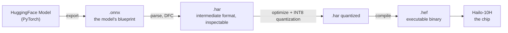
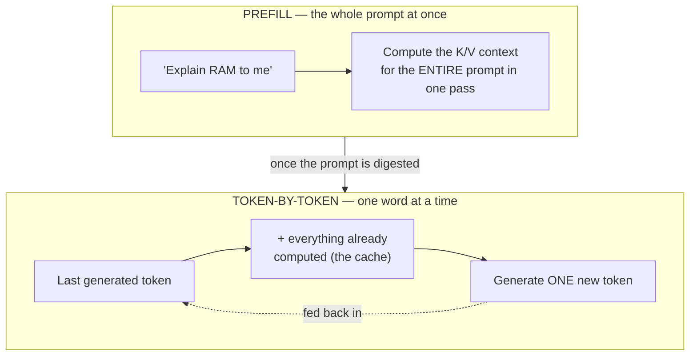
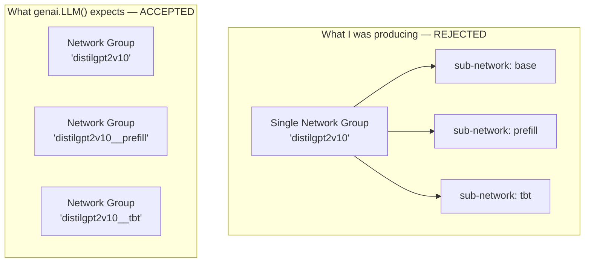
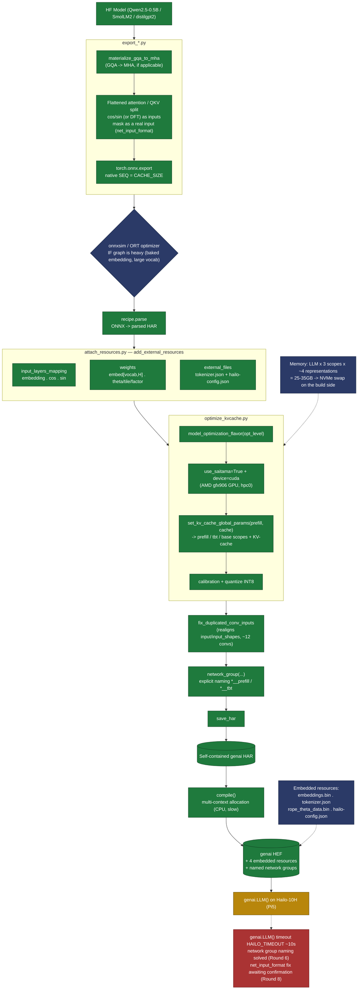

# Compiling an LLM on a Hailo 10H, a Bottomless Shithole

---

## Why This Project

The [Hailo-10H](https://hailo.ai/products/ai-accelerators/hailo-10h-ai-accelerator/) is the NPU Hailo sells for running LLMs on a Raspberry Pi 5 (and other SBCs). Unlike its vision-oriented cousins, this one is built from the silicon up for exactly that: 8GB of LPDDR4 on board!

At first, I tested my chip with [hailo-ollama](https://github.com/hailo-ai/hailo_model_zoo_genai), Hailo's homegrown "Ollama-like" tool that drives their precompiled models. I had fun for about two minutes, and then got bored fast. The models on offer are slow, and worse, locked to one very specific list:

- [Qwen/Qwen3-VL-2B-Instruct](https://hailo.ai/products/hailo-software/model-explorer/generative-ai/qwen3-vl-2b-instruct/)
- [Qwen/Qwen3-1.7B-Instruct](https://hailo.ai/products/hailo-software/model-explorer/generative-ai/qwen3-1-7b-instruct/)
- [Qwen/Qwen2-1.5B-Instruct-Function-Calling-v1](https://hailo.ai/products/hailo-software/model-explorer/generative-ai/qwen2-1-5b-instruct-function-calling-v1/)
- [meta-llama/Llama3.2-1B-Instruct](https://hailo.ai/products/hailo-software/model-explorer/generative-ai/llama3-2-1b-instruct/)
- [Qwen/Qwen2-1.5B-Instruct](https://hailo.ai/products/hailo-software/model-explorer/generative-ai/qwen2-1-5b/)
- [Qwen/Qwen2-VL-2B-Instruct](https://hailo.ai/products/hailo-software/model-explorer/generative-ai/qwen2-vl-2b/)
- [Qwen/Qwen2.5-1.5B-Instruct](https://hailo.ai/products/hailo-software/model-explorer/generative-ai/qwen2-5-1-5b/)
- [Qwen/Qwen2.5-Coder-1.5B-Instruct](https://hailo.ai/products/hailo-software/model-explorer/generative-ai/qwen2-5-coder-1-5b-instruct/)
- [deepseek-ai/DeepSeek-R1-Distill-Qwen-1.5B](https://hailo.ai/products/hailo-software/model-explorer/generative-ai/deepseek-r1-distill-qwen-1-5b/)

So basically, a handful of Qwen variants and a single Llama. The images below come from [Hailo's Model Explorer](https://hailo.ai/products/hailo-software/model-explorer/generative-ai/)

Except that today, there are far more interesting models to run on 8GB of RAM than this frozen catalog:

- [HuggingFaceTB/SmolLM3-3B](https://huggingface.co/HuggingFaceTB/SmolLM3-3B)
- [google/gemma-4-E2B-it](https://huggingface.co/google/gemma-4-E2B-it)
- [LiquidAI/LFM2.5-2.6B](https://huggingface.co/LiquidAI/LFM2.5-2.6B)

And having already managed to compile predictive models for a Hailo-8L in the past (see [my article on the subject](/posts/hailo8l-npu/)), I figured I'd try the same thing, but for LLMs, on the Hailo-10H.

And that's where it all begins.

Compiling *your own* model with the public Dataflow Compiler (DFC), outside the official catalog, is officially **not supported** by Hailo.

I have a pretty useful character flaw for this kind of situation: I can't stand being sold a tool and then told to use only a tenth of it. If the silicon can run LLMs, and the public compiler has the word "LLM" somewhere in its code, I need to know why it would work ONLY for the list of models that **Hailo** happened to pick. Either it's a genuine technical limit, or it's a commercial boundary drawn in chalk — and in that case, you step right over it. So I grabbed one of these newer models and tried to force it into the same mold as an official one, with zero documentation to help me, because **Hailo** doesn't provide any.

---

## What Is All This Mess, Exactly

A quick level-set before we dive into the meat of it. I'm not assuming everyone here has already tinkered with an NPU or read an LLM paper, so let's lay out the vocabulary once and for all.

**An NPU (Neural Processing Unit)** only knows how to do one thing: run an already-trained neural network, fast and on very little power. No training, no general-purpose computing like a CPU, no 3D rendering like a GPU. Just **inference** (running a model to get an answer), chaining matrix multiplications in a loop. The [Hailo-10H](https://hailo.ai/products/ai-accelerators/hailo-10h-ai-accelerator/) belongs to this family, in a daughterboard form factor for the Raspberry Pi 5.

**The Dataflow Compiler (DFC)** is Hailo's tool that turns a regular trained model into a binary the NPU can execute. Closed-source, x86_64 only, available on their [Developer Zone](https://hailo.ai/developer-zone/). Three formats follow one another in this pipeline:



- **[ONNX](https://onnx.ai/)**: a standard exchange format, independent of PyTorch/TensorFlow. The model's "blueprint," readable by pretty much any compiler.
- **HAR (Hailo Archive)**: a homegrown `.tar`, with the network described in JSON (readable, editable) and its weights alongside. The working format between parsing and compilation.
- **HEF (Hailo Executable Format)**: the final binary, the one you actually flash to the chip.

There's also some vocabulary specific to **LLMs** (Large Language Models, the kind of model behind ChatGPT or Qwen) that's worth keeping in mind for what follows. An LLM generates text one word at a time (well, one "token", a piece of a word), and it operates in two clearly distinct regimes:



- **Prefill**: the first pass, which swallows the whole prompt in one go.
- **Token-by-token (tbt)**: each word generated afterward, one at a time, reusing what's already been computed instead of redoing everything.
- **KV-cache**: the memory of what's already been computed (the "keys" and "values" of attention, K and V). Without it, generating the 500th word would mean recomputing the previous 499 every single time.

The DFC literally compiles two separate networks, one per regime. That's one of the most counter-intuitive things about this whole project, and it's going to keep coming up.

The rest of the technical vocabulary that's going to keep showing up throughout the article, in one single table so I don't have to redefine it every round:

| Term | Quick definition |
|---|---|
| **NPU** | A specialized chip for running neural networks, optimized for inference — not training. |
| **DFC (Dataflow Compiler)** | Hailo's closed-source tool that compiles a model (ONNX) into the executable `.hef` binary. |
| **ONNX** | Standard exchange format for a trained model — the "blueprint," independent of the original framework. |
| **HAR (Hailo Archive)** | Intermediate format — a `.tar` with the network in JSON and its weights, inspectable and hand-editable. |
| **HEF (Hailo Executable Format)** | The final binary, the one that actually runs on the chip. |
| **Prefill / Token-by-token (tbt)** | The two regimes of an LLM during generation: the whole prompt at once, then one word at a time. |
| **KV-cache** | The memory of what's already been computed (attention keys/values), so you don't redo everything for each word. |
| **MHA (Multi-Head Attention)** | "Classic" attention: each head has its own keys/values, no sharing. |
| **GQA (Grouped-Query Attention)** | A variant that shares keys/values across multiple heads, to save memory. |
| **QK-Norm** | A per-head attention normalization present in some models (Qwen3) — breaks a pattern the Hailo parser recognizes. |
| **RoPE (Rotary Position Embedding)** | The most common method for encoding a token's position, via cos/sin angles. |
| **Quantization (INT8)** | Reducing weight precision (from float to 8-bit integer) so the model fits and runs fast on the chip. |
| **Network group** | A deployment unit within a `.hef` — a `genai` LLM has several, one of which must be named `*__prefill`. |
| **`genai.LLM()`** | Hailo's high-level runtime API, the one that drives an already-compiled LLM — the real gatekeeper of this project. |

---

## Round 1: Install the Latest DFC and Redo What I Already Know

I started by installing the latest version of the Dataflow Compiler (5.3.0), the same closed-source, x86_64-only tool I'd already tamed for the Hailo-8L article:

```bash
pip install hailo_dataflow_compiler-5.3.0-py3-none-linux_x86_64.whl
hailo --version
```

And I naively tried to apply the exact same recipe as on the 8L: `ONNX -> HAR -> HEF`. On MNIST, that boiled down to three calls to `ClientRunner` and done. For an LLM, I was missing an ingredient, so before even touching a real model, I dug through the DFC's Python SDK (`hailo_sdk_client`, not obfuscated, plain readable Python) to understand how the official catalog handled the KV-cache.

And there it was: an internal pass called `DuplicateLLMToNetworkGroups` runs systematically during optimize, but silently switches itself off if one specific parameter hasn't been set. That parameter is a model-script command that isn't documented anywhere for this purpose:

```python
set_kv_cache_global_params(prefill_size, cache_size)
```

One single line, buried in the generic model-script docs, turns out to be the sole trigger for the entire prefill/tbt/KV-cache mechanism. The public DFC, the one anyone can download for free, already knows how to do all of this — nobody just bothers to say so anywhere. I turned it into the core of my own tool, `recipe.py`, which I reused as-is for the rest of the project:

```python
def optimize_llm(runner, prefill_size, cache_size, calib,
                 optimization_level=0, extra_script="", har_out=None):
    """Enables the LLM pass and quantizes."""
    script = (
        f"model_optimization_flavor(optimization_level={optimization_level})\n"
        f"set_kv_cache_global_params({prefill_size}, {cache_size})\n"
        f"{extra_script}"
    )
    runner.load_model_script(script)
    runner.optimize(calib)
    if har_out:
        runner.save_har(har_out)
    return runner
```

I confirmed this actually worked on a minimal toy case — a single attention head and nothing else: three scopes after optimization (base, prefill, tbt), cache layers automatically inserted, and a `.hef` whose binary header matched an official `.hef`'s byte for byte in its structure. The basic mechanism works.

All that was left was making it hold up on a real model. Naively, I thought that would be the easy part.

---

## And That's When Everything Started Going to Shit

First attempt, with Qwen3-0.6B, because it's the one I knew best and seemed like a solid starting point. `translate_onnx_model` blew up immediately:

```
ValueError: Unspecified inputs: {'attention_mask'}
```

My ONNX export had two inputs, the embeddings and the attention mask, and the Hailo parser demands that **all** inputs be declared with a static shape — no dynamic axis tolerated. I ended up baking the causal mask as a constant directly into the export wrapper, leaving only one controllable input (`inputs_embeds`). That one was the easy wall.

The second one showed up right after, on the attention mechanism itself:

```
UnexpectedNodeError: Expand (self_attn/Expand)
UnsupportedShuffleLayerError: Reshape (self_attn/Reshape_3)
```

Qwen3, like most recent LLMs, uses **GQA** (Grouped-Query Attention): several Q heads share the same K/V heads to save memory. This dynamic duplication of K/V (`repeat_kv` on the PyTorch side, an `Expand` once exported to ONNX) simply isn't a pattern the Hailo frontend knows how to translate. I ended up physically materializing GQA into MHA at export time, duplicating the K/V weights so each Q head gets its own copy instead of sharing them dynamically. It costs memory, but the export no longer emits any `Expand`, and that wall falls too.

The third one, though, wasn't going to fall:

```
UnsupportedShuffleLayerError: Reshape (self_attn/Reshape_1)
```

Across Qwen3's 28 layers, the exact same reshape breaks every single time — the one that isolates the attention heads, `[1,32,2048] -> [1,32,16,128]`. Hailo recognizes the pattern of "a `reshape` glued directly to a `transpose`" and fuses it into a simple 4D format conversion. Except Qwen3 has a **QK-Norm**, a per-head normalization slipped in between the reshape and the transpose, and the moment any operator wedges itself between the two, the pattern breaks and the parser gives up. I wasted an enormous amount of time thinking it was some dynamic-shape issue I needed to pin down somewhere. It was actually an architectural wall, not a setting waiting to be found.

Three flat-out walls for a single model, and the third one stops everything cold. Which is to say, "just follow the same logic as the Hailo-8L" lasted about as long as it took me to understand this paragraph.

---

## Round 2: Ditch Qwen3, Pick a Model Without QK-Norm

Facing an architectural wall, there are two options: rewrite the attention forward pass in a Hailo-friendly 4D layout (a heavy undertaking, no guarantee it even works), or switch targets to validate the hypothesis first and see if the rest holds up. I took the second option, switching targets to see if the rest of the plan held up, and moved to Qwen2.5-0.5B, same family but without QK-Norm.

It confirmed the hypothesis right away: without QK-Norm, the `reshape` and `transpose` become adjacent again, Hailo fuses them into a format conversion, and the `UnsupportedShuffleLayerError` disappears. It really was the QK-Norm breaking the pattern, nothing else.

Except the moment I tried parsing the full model (24 layers, not just a toy block), a new wall showed up:

```
NetworkXUnfeasible: Graph contains a cycle
```

This one came from Hailo itself: the DFC disables its own internal ONNX simplification on "large" models, and with a 151,936-token vocabulary, the `lm_head` alone is enough to tip it into that category. I had to simplify the graph myself, upstream, with `onnx-simplifier`:

```bash
python -m onnxsim qwen_body.onnx qwen_body_sim.onnx --no-large-tensor
```

And there, first real result: a complete Qwen2 transformer block (RMSNorm, RoPE, attention, SwiGLU MLP) parses and compiles in full. `q1plain.hef`, 13MB, no cache yet.

The logical next step was to re-enable `set_kv_cache_global_params` on this same block. Optimize and quantization go through without a hitch, but compile crashes:

```
Invalid kernel shape for conv down_proj, Groups: 0
```

This one, no way to dodge it by switching models — I had to actually understand what was going on inside the `.hn` (the JSON describing the network inside the HAR). Digging in, I eventually found the exact cause. On a residual-connected conv like `down_proj` (the one in the SwiGLU MLP, which merges the MLP output with the residual), Hailo's duplication pass reorders the layer's list of inputs without reordering the corresponding list of shapes. Harmless when both inputs are the same size, since there's no ambiguity in the order. Fatal when they differ, which is exactly the case for `down_proj` with its 4864→896. A genuine bug in Hailo's closed-source pass, not a configuration mistake on my end.

The only option left was direct surgery on the `.hn`: for each affected conv, reorder its list of inputs so that each entry points to the layer whose output feature count actually matches what the conv expects.

```python
def fix_duplicated_conv_inputs(har_in, har_out):
    """Fixes the Hailo LLM pass bug: `input` misaligned with `input_shapes`
    on residual-connected convs after prefill/tbt duplication."""
    hn = load_hn(har_in)                      # extracts the .hn from the HAR .tar
    fixed = 0
    for layer in hn["layers"].values():
        if layer.get("type") != "conv":
            continue
        ins, shapes = layer.get("input"), layer.get("input_shapes")
        want = [s[-1] for s in shapes]          # expected feature count, by position
        got = [feature_count(n) for n in ins]   # actual feature count, in current order
        if got == want:
            continue
        layer["input"] = reorder_to_match(ins, want)   # realigns input <-> input_shapes
        fixed += 1
    save_hn(hn, har_out)
    return fixed
```

(Condensed version here — the actual `recipe.py` script walks the HAR's `.tar` by hand, with no external dependency.) Once this fix was applied, the same Qwen2 block compiled with cache this time: `q1blk_cache.hef`, 36MB, prefill/tbt groups and cache layers all present. I reused it as-is on every following model — 12 convs fixed on each run for `distilgpt2` (2 per block × 6 blocks), a pattern regular enough to be almost suspicious.

What was left was checking that all of this actually ran on silicon and not just on the compiler's paper. Off to the Raspberry Pi 5 with the Hailo-10H plugged in: `hailortcli run2` on the cache-less block runs at ~512 FPS on the NPU, proof that the pipeline actually produces executable models and not just binaries that merely pass compilation. The cached block, on the other hand, gets flatly rejected:

```
HAILO_INTERNAL_FAILURE
```

`run2` is a generic benchmark, it has no idea how to handle stateful layers like the KV-cache — it needs a runtime that understands the prefill→tbt loop. That runtime is precisely `genai.LLM()`, the same one the official catalog uses. That realization shifted the whole focus of the project: stop trying to write my own inference runtime, and instead figure out exactly what `genai.LLM()` requires from a `.hef` before it agrees to load it.

---

## Round 3: The Real Contract, the One `genai.LLM()` Enforces

Compiling a block that runs is one thing. Satisfying the high-level runtime Hailo runs internally for its own catalog is another matter entirely, and nothing in the public docs describes it. So I fell back on what had already worked for cracking the DFC's mechanics: go find an official artifact and dissect it instead of guessing. I downloaded the official HAR for [Qwen2-1.5B-Instruct](https://huggingface.co/Qwen/Qwen2-1.5B-Instruct) — 38GB that don't just torrent themselves on a whim — and compared it line by line against mine.

What `genai.LLM()` actually expects, none of which the docs mention:

- The network takes **raw token IDs and positions** as input, not embeddings or precomputed RoPE from the host side. Embedding and the [RoPE](https://arxiv.org/abs/2104.09864) computation happen *on-chip*.
- **Four resources** are embedded directly in the `.hef`: the embedding table (`embeddings.bin`), the tokenizer (`tokenizer.json`), the RoPE angles (`rope_theta_data.bin`), and a JSON config file (`hailo-config.json`: stop tokens, default generation params).
- The official Qwen contract has **6 input layers**, not 3: embeddings, attention mask, and RoPE cos/sin **split separately for Q and K** (Q wide, K narrow — makes sense, GQA-aware).
- The `.hef` must contain several named network groups, one of which literally has to end in `__prefill` — I only discovered that one much later (Round 6), the hard way.

Attaching these resources happens before the optimize step, through `add_external_resources`, an SDK command I had to decode straight from its source code since it's undocumented for this use case. Here's the part of my `genai_resources.py` that builds the RoPE cos/sin channel:

```python
def rope_theta_angles(head_dim, base):
    inv = 1.0 / (base ** (np.arange(0, head_dim, 2) / head_dim))
    return np.concatenate([inv, inv])                    # [head_dim]

mapping = {f"{scope}/input_layer2": "cos", f"{scope}/input_layer3": "sin"}
weights = {
    f"{scope}/input_layer2": {"tile": [1, 1, n_heads], "factor": 1.0, "theta": theta},
    f"{scope}/input_layer3": {"tile": [1, 1, n_heads], "factor": 1.0, "theta": theta},
}
runner.add_external_resources({
    "input_layers_mapping": mapping,
    "weights": weights,
    "external_files": {"tokenizer.json": tok_path, "hailo-config.json": cfg_path},
})
```

The `genai` runtime never feeds precomputed cos/sin — just raw integer positions. It's the `cos`/`sin` layer itself, inserted by this command, that computes `factor * cos(theta * position)` internally, at every generation step.

Funny detail found while digging through Hailo's official LoRA fine-tuning tutorial, the only public tutorial that touches an LLM at all: it downloads the ready-made Qwen 1.5B HAR directly, and never shows the ONNX → HAR step. Hailo doesn't document the hardest step of this entire project anywhere, simply because it's strictly internal to them. What I had to reproduce from scratch, they themselves have never published.

---

## Round 4: Pivoting to `distilgpt2`, to Stop Fighting on Two Fronts

At this point, [SmolLM2-135M-Instruct](https://huggingface.co/HuggingFaceTB/SmolLM2-135M-Instruct), my de-risking model, was tangling up two distinct problems: getting GQA to work properly on Hailo, and satisfying the `genai` contract. I could never quite tell which of the two I was actually debugging.

I ended up switching to a model that eliminates the first problem entirely. [`distilgpt2`](https://huggingface.co/distilbert/distilgpt2), 6 layers, 12 heads, pure MHA, zero GQA, lets you isolate the `genai` contract question by itself, with no architectural noise. It stayed my working model for the rest of the project.

---

## Round 5: `SEQ = CACHE_SIZE`, and a Fourier Transform Sleight of Hand

After a few iterations on the ONNX architecture (QKV attention split into 3 separate convs, exactly what the official HAR also does as I'd discover later; GELU replaced by its sigmoid approximation; mask baked in as a constant), I hit a shape bug in the cache pass. An integer division that comes out to 0 when the exported sequence is smaller than the cache size.

Reading the code of the internal pass that injects the actual dynamic caching mechanism, I found the real rule: it only activates on a matmul if the second operand has `input_shape[-2] == cache_size` natively, right at parse time. Exporting at `SEQ = prefill_size` and hoping the pass would "grow" it on its own up to `cache_size` just doesn't work. I had to export natively at `SEQ = CACHE_SIZE`: the causal mask guarantees nothing is numerically lost past the actual prefill. First `distilgpt2` KV-cache HEF that compiles, 91MB. Except `genai.LLM()` times out at ~2 minutes, since the genai resources were still missing.

The next wall was trickier. The `genai` format only keeps a single embedding table in the final HEF, no matter how many I attach. The catch is that GPT2 natively has two learned tables: one for tokens (`wte`) and one for positions (`wpe`), unlike Qwen/Llama which only have a token table and encode position through RoPE. No way to fit both in.

I ended up pulling the position encoding out of the embedding table and carrying it instead over `genai`'s native cos/sin channel, normally reserved for RoPE, through a Fourier-series reconstruction of the `wpe` table:

```python
fft_coef = np.fft.rfft(wpe_full, axis=0)          # frequency decomposition
A[0]  = fft_coef[0].real / N
A[1:] = 2 * fft_coef[1:].real / N
B[1:] = -2 * fft_coef[1:].imag / N
```

With enough frequencies (`K = CACHE_SIZE//2+1`), the `wpe` reconstruction comes out nearly exact, error on the order of 1e-14, a simple [FFT](https://en.wikipedia.org/wiki/Discrete_Fourier_transform)/inverse round trip. So a model with learned positions ends up reusing the pipe meant for RoPE, just repurposed a bit. Result: cosine similarity of 0.999964 on the full forward pass, and more importantly — a sign that something was finally moving structurally — the `genai.LLM()` timeout drops from ~2 minutes to ~10.3 seconds.

---

## Round 6: Comparing Against Qwen Changes Everything

Obvious question at this stage: what if the number of frequencies (`K`) in my repurposed cos/sin channel was the actual cause of the slowdown? Real RoPE uses a small, fixed `K` (`head_dim/2`, often ~32), independent of context length, whereas mine climbed to 129, even 257. I forced `K=32`, at the cost of a truncated, and thus approximate, DFT reconstruction (cosine 0.999443 instead of 0.999972). HEF produced after a 1h23 compile, and... timeout at 10.243 seconds. Basically identical. Hypothesis invalidated.

As frustrating as that negative result was, it eventually unlocked the real question: why such a constant time, regardless of HEF size or frequency count? The answer came from a dead-simple comparison. I loaded the official `.hef` for Qwen2-1.5B-Instruct, 1.7GB, 13 times bigger than mine, on the same Pi5. Load time: 4.55 seconds. Smaller, bigger, didn't matter — my HEF was structurally different from theirs even though the contract was nearly identical. So it was neither a size question nor a PCIe bandwidth one.

The answer turned up somewhere I hadn't looked yet: the logs of the firmware running on the chip itself. The Hailo-10H runs its own mini-Linux, confirmed via `dmesg` on the Pi5 side, loading `customer_certificate.bin`, `scu_fw.bin`, `u-boot-spl.bin`, a full `fitImage` at boot. `hailortcli logs runtime` exposes its logs directly:

```
[llm_inference_manager.cpp:31] [create] CHECK failed - Model doesnt have NG with name-suffix '__prefill'
[llm_server.cpp:201] [operator()] CHECK_SUCCESS failed with status=HAILO_INTERNAL_FAILURE(8)
```

My HEF only contained a single catch-all network group, bundling the three scopes (base/prefill/tbt) as three internal sub-networks, instead of several separate groups, one of which needs a name literally ending in `__prefill`. That's what the firmware was looking for, and never finding, ever since the very first compile.



By grepping the DFC's source code instead of firing off yet another blind compile, I finally found the model-script command that lets you force this explicitly: `network_group(<scopes>)`. First attempt with names of my own choosing (`prefill_ng`, `tbt_ng`...): structure finally correct, 3 well-formed groups, verified via `hailortcli parse-hef`. But `genai.LLM()` still timed out with the exact same error, because the firmware literally does `name.endswith("__prefill")`, and `prefill_ng` obviously doesn't match. I had to rename the groups exactly like the existing scopes (`distilgpt2v10__prefill`, etc.) for it to finally go through.

---

## Round 7: A New Wall, and a Rule I Imposed on Myself

Naming issue solved, `genai.LLM()` finally makes it further than ever before, up until a new ~10-second silence, then `HAILO_TIMEOUT`, without a single log line in between.

My first temptation was to patch the timeout constants directly in memory inside the closed-source `libhailort.so` binary. Zero effect, despite confirmed loading. And for good reason, once I understood it via the public headers: these constants are declared `constexpr` in C++, so the compiler inlines them as an immediate value at every call site. The value you patch into the binary is never read anywhere at runtime. I've set myself a rule since then: read-only reverse-engineering only — public headers, `strings`, verbose logs. Understand the contract rather than blindly poke at the symptom.

The public headers, at least, are crystal clear on the value in question:

```cpp
// hailo/genai/llm/llm.hpp
static constexpr std::chrono::milliseconds LLMGeneratorCompletion::DEFAULT_READ_TIMEOUT = std::chrono::seconds(10);
```

Ten seconds, exactly what we observe. A `strace -f -tt` on the client side confirms the mechanism: two sequential `futex` waits with an explicit timeout (`ETIMEDOUT` after ~4.6s then exactly 5.0s, total ~9.6s). Not a deadlock, more of a time-bounded polling pattern — the client is actively waiting for a response that never arrives. I tried to pin down the exact function via `gdb`, without success: `libhailort.so` exports almost no symbols, backtraces full of `?? ()`, and under `ptrace` the futex count explodes within a few seconds. No way to target the right window without debug symbols, which Hailo doesn't provide.

---

## Round 8: The Missing Mask, Four Failures, and a Last-Minute Discovery

The next lead was more actionable: the official Qwen contract has 6 input layers, mine only has 3, and the attention mask has been baked in as a constant since Round 5, never passed as a real input. What if that was exactly what the runtime was expecting and not finding?

Four attempts led to four failures, each one the same underlying reason wearing a different disguise:

1. **v14** — naive `[1,1,SEQ,SEQ]` mask as a real ONNX input. `optimize()` blows up (`InvalidInputShape`), the parser treats the last two dimensions as two spatial dimensions.
2. **v15** — mask correctly tiled to the official shape (heads folded into the channel dimension, not spatial), manually wired via `Slice`+`Add`. Still breaks, this time because the automatic fusion Hailo applies for a constant mask no longer applies to a real input.
3. **v16** — let the model-script's `set_input_mask_to_softmax()` directive perform the surgery itself on a "floating" mask in the graph. Either `torch.onnx.export` silently prunes the input because it's never actually used in the computation, or the Hailo parser rejects it (`Couldn't find inputs from ONNX proto`).
4. **v17** — exact reconstruction of the official Qwen recipe, decomposed layer by layer from their HAR (multiplicative 1/0 mask, not an additive `-inf` one — yet another discrepancy found along the way). Clean export, cosine 0.999448... and the exact same failure, identical to the others.

Four different formulations of the same mask, four identical failures. So it wasn't the formulation that was the problem, but simply the presence of a real input tensor intersecting the attention computation.

The way out came from a suggestion as simple as it was obvious: look for a parser parameter before launching into manual `.hn` surgery. `translate_onnx_model` has a `net_input_format` parameter, never encountered until then, whose docstring reveals the real cause. By default, a rank-4 input is interpreted as `NCHW` (channels in second position). My mask `[1,1,SEQ,NHEAD*SEQ]` was therefore read as `channel=1, height=SEQ, width=NHEAD*SEQ`, with both real dimensions understood as spatial. The single root cause behind all four previous failures, independent of anything I'd tried tinkering with on the mask side.

```python
runner.translate_onnx_model(
    "model.onnx", "m",
    net_input_format={"attention_mask": [Dims.BATCH, Dims.HEIGHT, Dims.WIDTH, Dims.CHANNELS], ...},
)
```

Result: no more matmul with a parasitic spatial grid, perfectly clean, as if there were no mask at all. The rest of the pipeline is in progress as I write these lines.

---

## Where Things Stand

Concretely, the network group naming wall (Round 6) is solved, and the last structural problem identified on the ONNX parser side (Round 8, `net_input_format`) has a fix that works numerically. What I haven't confirmed yet is whether this fix actually kills the 10-second timeout once it's run back through the whole pipeline: optimize, quantization, compile, and a real `genai.LLM()` test on the Pi5.

Here's an overview of the whole chain, as it stands today: green for what's validated, orange for what runs but is still stuck, red for the exact point of failure.



This project never had a fixed end date, and this article isn't about to invent one. I'm still digging, and what comes next — whether it works, or I run into an even taller wall — will be the subject of a future article.

---

*This article was written with Claude's help, based on my raw technical notes. Everything in it may therefore contain errors, shortcuts, or approximations.*
