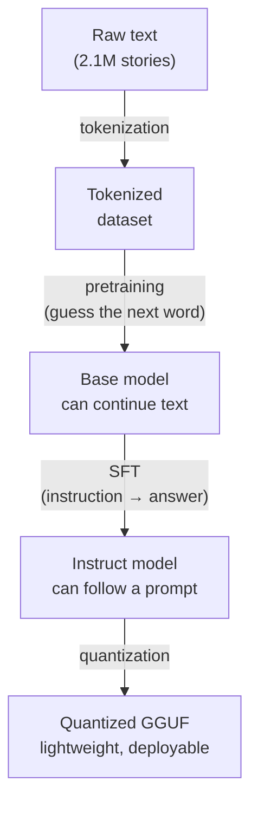

---

## Why This Project

In [the previous post](/en/posts/testing-weird-ai-configs/), I ended up running inference on a Tesla T10 picked up for €300 — a card that, in another life, streamed cloud gaming for GeForce Now. Fun, but let's be honest for a second: running a model someone else trained is the bare minimum. Anyone with `ollama pull` can do that in thirty seconds.

What was itching at me was the part before that. Where the model actually comes from. How you go from a pile of raw text to something that strings together sentences that hold up. When you use Claude, ChatGPT, or Mistral day to day, you type a prompt, out comes an answer, and everything in between is black magic to pretty much everyone who uses it.

This project is the anti-black-magic. Can I run the *entire* pipeline myself, from raw text all the way to a quantized model ready to deploy, without going through nanoGPT or an `AutoModel.from_pretrained()` doing the dirty work for me?

Spoiler: yes. But not without taking a genuinely vicious bug straight to the face along the way. I'll get back to it, it fully deserves the spotlight.

The full pipeline fits in four stages:



**Dataset → Pretraining → SFT → PTQ.** Four sections, one article. And all of it on the T10, in Docker, so I don't turn hpc1 into a Python-dependency dumpster every time an experiment goes sideways.

---

## The Setup

Nothing new on the hardware side compared to the previous post — still the same HP Z440 workstation and its Tesla T10 (Turing, compute capability 7.5, 15.6GB of VRAM). What's different is that this time everything runs through [Docker](https://docker.com) + the [NVIDIA Container Toolkit](https://docs.nvidia.com/datacenter/cloud-native/container-toolkit/latest/index.html), so I can throw everything away and start over without leaving a mess on the system.

Installing Docker CE (Ubuntu 26.04 isn't in the official repos yet as of this writing, so the `noble` suffix from 24.04 does the job just fine):

```bash
apt-get update
apt-get install -y ca-certificates curl gnupg
install -m 0755 -d /etc/apt/keyrings
curl -fsSL https://download.docker.com/linux/ubuntu/gpg -o /etc/apt/keyrings/docker.asc
chmod a+r /etc/apt/keyrings/docker.asc

echo \
  "deb [arch=$(dpkg --print-architecture) signed-by=/etc/apt/keyrings/docker.asc] https://download.docker.com/linux/ubuntu \
  noble stable" | tee /etc/apt/sources.list.d/docker.list

apt-get update
apt-get install -y docker-ce docker-ce-cli containerd.io docker-buildx-plugin docker-compose-plugin
```

Then the NVIDIA Container Toolkit, so containers can actually see the GPU:

```bash
curl -fsSL https://nvidia.github.io/libnvidia-container/gpgkey | gpg --dearmor -o /usr/share/keyrings/nvidia-container-toolkit-keyring.gpg

curl -s -L https://nvidia.github.io/libnvidia-container/stable/deb/nvidia-container-toolkit.list | \
  sed "s#deb https://#deb [signed-by=/usr/share/keyrings/nvidia-container-toolkit-keyring.gpg] https://#g" | \
  tee /etc/apt/sources.list.d/nvidia-container-toolkit.list

apt-get update
apt-get install -y nvidia-container-toolkit

nvidia-ctk runtime configure --runtime=docker
systemctl restart docker
```

And the obligatory sanity check:

```bash
docker run --rm --gpus all nvidia/cuda:12.6.3-base-ubuntu24.04 nvidia-smi -L
# GPU 0: Tesla T10 (UUID: ...)
```

For training, an image based on the official PyTorch+CUDA image, with just what's needed on top (`docker/Dockerfile`):

```dockerfile
FROM pytorch/pytorch:2.6.0-cuda12.4-cudnn9-runtime

WORKDIR /workspace

RUN pip install --no-cache-dir \
    datasets \
    tokenizers \
    tqdm \
    numpy \
    safetensors

COPY src/ /workspace/src/
```

```bash
docker build -t llm-from-scratch -f docker/Dockerfile .

docker run --rm --gpus '"device=0"' llm-from-scratch \
  python -c "import torch; print(torch.cuda.get_device_name(0))"
# Tesla T10
```

One small detail that matters for what follows: the T10 is **Turing**, so it has Tensor Cores in **fp16**, but no native bf16 (that only arrived with Ampere). So the whole training run uses `torch.autocast` fp16 + `GradScaler`, not bf16, the usual go-to on a newer card.

---

## The Dataset

For a from-scratch pretraining run that fits in an evening rather than a month, I needed a small, simple dataset. I picked **[TinyStories](https://huggingface.co/datasets/roneneldan/TinyStories)**: a corpus of tales generated by GPT-3.5/4 with a deliberately restricted vocabulary, designed by Microsoft Research specifically to prove that a tiny model can produce coherent text.

Quick detour for anyone who's never gotten their hands dirty with this: an LLM doesn't read text letter by letter. Before anything goes into the model, the text has to be chopped into small chunks called **tokens** — sometimes a whole word, sometimes just part of one, sometimes a single character. The tool that does this chopping is called a **tokenizer**, and **vocab_size** is simply the number of distinct tokens it knows. The most common way to build one is called **BPE** (Byte Pair Encoding): roughly, you start from raw characters and progressively merge the pairs that show up most often in the corpus, until you reach a vocabulary of the desired size. The smaller this vocabulary, the more often the model runs into the same tokens during training — handy when the corpus is deliberately simple, like TinyStories.

2,119,719 stories for training, 21,990 for validation. I trained my own byte-level BPE tokenizer on top of it (vocab_size 8192, via HuggingFace's `tokenizers` library — writing a BPE trainer completely by hand would have been an entire project on its own, so I'm making an exception here), then tokenized everything into two large `uint16` binary files, loadable via `memmap` during training without needing everything to fit in RAM. The full script (`src/prepare_data.py`):

```python
from pathlib import Path

import numpy as np
from datasets import load_dataset
from tokenizers import Tokenizer, decoders, models, pre_tokenizers, trainers

DATA_DIR = Path("/workspace/data")
VOCAB_SIZE = 8192


def train_tokenizer(dataset):
    tokenizer = Tokenizer(models.BPE(unk_token="<unk>"))
    tokenizer.pre_tokenizer = pre_tokenizers.ByteLevel(add_prefix_space=False)
    tokenizer.decoder = decoders.ByteLevel()

    trainer = trainers.BpeTrainer(
        vocab_size=VOCAB_SIZE,
        special_tokens=["<unk>", "<pad>", "<eos>"],
    )

    def text_iterator():
        for example in dataset:
            yield example["text"]

    tokenizer.train_from_iterator(text_iterator(), trainer=trainer, length=len(dataset))
    return tokenizer


def tokenize_split(tokenizer, dataset, eos_id, out_path):
    ids = []
    for example in dataset:
        ids.extend(tokenizer.encode(example["text"]).ids)
        ids.append(eos_id)
    arr = np.array(ids, dtype=np.uint16)
    arr.tofile(out_path)
    return len(arr)


def main():
    DATA_DIR.mkdir(parents=True, exist_ok=True)

    ds = load_dataset("roneneldan/TinyStories")
    tokenizer = train_tokenizer(ds["train"])
    tokenizer.save(str(DATA_DIR / "tokenizer.json"))
    eos_id = tokenizer.token_to_id("<eos>")

    n_train = tokenize_split(tokenizer, ds["train"], eos_id, DATA_DIR / "train.bin")
    n_val = tokenize_split(tokenizer, ds["validation"], eos_id, DATA_DIR / "val.bin")
    print(f"train.bin: {n_train:,} tokens, val.bin: {n_val:,} tokens")


if __name__ == "__main__":
    main()
```

```bash
docker run --rm --gpus '"device=0"' \
  -v $(pwd)/src:/workspace/src -v $(pwd)/data:/workspace/data \
  llm-from-scratch \
  python src/prepare_data.py
```

```
train.bin: 466,602,707 tokens (890 MB)
val.bin:     4,689,785 tokens (9 MB)
```

Downloading from HuggingFace, training the tokenizer, encoding the 2.1M stories: all of that is pure, unglamorous CPU work. Zero matmuls, so the T10 sits at 0% while I watch a progress bar for 16 minutes. Part of the folklore: you think you're kicking off a GPU job, and really you're just waiting for Python to finish a for loop.

---

## The Model: A Hand-Written Decoder-Only GPT

No nanoGPT here, no `transformers.GPT2Model`. A classic decoder-only transformer, built brick by brick in a single `model.py` file.

For anyone who's never popped the hood on a transformer: the core mechanism is **attention**. It's what lets every word "look at" the words before it and decide which ones matter for guessing what comes next. In "the cat eats its ___", the model needs to understand that "cat" and "eats" carry more weight than "the" for guessing "food" rather than something random. **Multi-head** means it runs this computation several times in parallel, each with a different "angle," to capture several kinds of relationships between words simultaneously. **Causal** means a word can ONLY look at what comes before it, never what comes after — otherwise the model would be cheating, reading the answer before it's even guessed it, and training would stop meaning anything.

What was hand-coded, no shortcuts:

- **Embeddings** for token + position
- **Causal multi-head attention**, hand-coded: QKV projections, `QKᵀ/√head_dim` scores, precomputed causal triangular mask, softmax — no fused kernel, no flash-attention, plain vanilla PyTorch
- A classic **MLP** behind each attention block, to digest what attention picked up on (×4 expansion, GELU, projection back down) — nothing more exotic than two linear layers with an activation in between
- **Pre-norm** everywhere (LayerNorm *before* attention/MLP rather than after) — the most stable way to train a small model without spending hours tuning the warmup
- **Weight tying** between the input embedding and the output head — the two literally share the same weight matrix, which cuts down the parameter count and helps a small model generalize better

Config and attention, the heart of `src/model.py`:

```python
@dataclass
class GPTConfig:
    vocab_size: int = 8192   # matches the tokenizer trained in prepare_data.py
    block_size: int = 256    # max context length
    n_layer: int = 8
    n_head: int = 8
    n_embd: int = 512
    dropout: float = 0.0


class CausalSelfAttention(nn.Module):
    def __init__(self, config: GPTConfig):
        super().__init__()
        self.n_head = config.n_head
        self.head_dim = config.n_embd // config.n_head

        self.qkv_proj = nn.Linear(config.n_embd, 3 * config.n_embd)
        self.out_proj = nn.Linear(config.n_embd, config.n_embd)

        # position i can only look at positions <= i
        mask = torch.tril(torch.ones(config.block_size, config.block_size, dtype=torch.bool))
        self.register_buffer("causal_mask", mask, persistent=False)

    def forward(self, x):
        B, T, C = x.shape
        qkv = self.qkv_proj(x)
        q, k, v = qkv.split(C, dim=2)

        q = q.view(B, T, self.n_head, self.head_dim).transpose(1, 2)
        k = k.view(B, T, self.n_head, self.head_dim).transpose(1, 2)
        v = v.view(B, T, self.n_head, self.head_dim).transpose(1, 2)

        att = (q @ k.transpose(-2, -1)) / (self.head_dim ** 0.5)
        att = att.masked_fill(~self.causal_mask[:T, :T], float("-inf"))
        att = F.softmax(att, dim=-1)

        out = att @ v
        out = out.transpose(1, 2).contiguous().view(B, T, C)
        return self.out_proj(out)
```

The rest (`MLP`, `Block` which assembles attention + MLP in pre-norm with residuals, `GPT` which stacks the blocks) follows the same logic, no surprises. Final config: 8 layers, 8 heads, dimension 512, context of 256 tokens. **29.5 million parameters.** A featherweight compared to any commercial LLM (GPT-4 or Claude run with several orders of magnitude more parameters), but plenty for what's being asked of it here.

A quick sanity check before diving in:

```bash
docker run --rm --gpus '"device=0"' \
  -v $(pwd)/src:/workspace/src -w /workspace/src \
  llm-from-scratch \
  python -c "
import torch
from model import GPT, GPTConfig

config = GPTConfig()
model = GPT(config).cuda()
print('Parameters:', sum(p.numel() for p in model.parameters()))

idx = torch.randint(0, config.vocab_size, (4, 128), device='cuda')
targets = torch.randint(0, config.vocab_size, (4, 128), device='cuda')
logits, loss = model(idx, targets)
print('loss:', loss.item())
"
```

```
Parameters: 29,545,472
loss: 9.20398998260498
```

At initialization, without a shred of training, the loss was 9.20 — consistent with `ln(8192) ≈ 9.01`, the theoretical loss of a model predicting completely at random across the vocabulary's 8192 tokens. Always satisfying to see the math check out before you've even trained anything.

---

## Pretraining

Another quick detour, because this is going to come up throughout: the **loss** is a single number summarizing how badly the model gets it wrong, on average, for each word it's trying to guess. Lower is better. It necessarily starts high (the model spits out random garbage, as we just saw) and is supposed to drop as it learns patterns in the text.

A homemade training loop (`src/train.py`): loading the `.bin` files as `np.memmap` (no need to load 890MB into RAM all at once), random sampling of `block_size`-token windows, `AdamW`, linear warmup followed by cosine decay, fp16 + `GradScaler`, gradient clipping. The heart of the batching, which properly shifts x and y by one position (this is going to matter later, in the SFT section):

```python
def get_batch(data, block_size):
    ix = torch.randint(len(data) - block_size - 1, (batch_size,))
    x = torch.stack([torch.from_numpy(data[i:i + block_size].astype(np.int64)) for i in ix])
    y = torch.stack([torch.from_numpy(data[i + 1:i + 1 + block_size].astype(np.int64)) for i in ix])
    return x.to(device), y.to(device)
```

And the loop itself, condensed:

```python
for it in range(max_iters + 1):
    x, y = get_batch(train_data, config.block_size)
    with torch.autocast(device_type="cuda", dtype=torch.float16):
        _, loss = model(x, y)

    optimizer.zero_grad(set_to_none=True)
    scaler.scale(loss).backward()
    scaler.unscale_(optimizer)
    torch.nn.utils.clip_grad_norm_(model.parameters(), grad_clip)
    scaler.step(optimizer)
    scaler.update()
```

A cold smoke test over 20 iterations gave ~48k tokens/s — enough to estimate that a full **epoch** (the model sees every example in the dataset once, no more) over the 466M tokens would take around 2h40.

I kicked off the full run in a detached container (`docker run -d`), because losing hours of work to a dropped SSH session mid-training is really not my idea of a good time:

```bash
docker run -d --name llm-pretrain --gpus '"device=0"' \
  -v $(pwd)/src:/workspace/src -v $(pwd)/data:/workspace/data -v $(pwd)/checkpoints:/workspace/checkpoints \
  -w /workspace/src \
  llm-from-scratch \
  python train.py --max_iters 28479 --eval_interval 500 --eval_iters 50

docker logs -f llm-pretrain   # to follow along live
docker wait llm-pretrain      # to block until it's done
```

Actual throughput settled around **71,000 tokens/s** once the CUDA warmup was out of the way — well above the cold estimate. A full epoch, **1h49** instead of the projected 2h40.


Train and val curves overlap almost perfectly from start to finish. Makes sense: with 466M tokens seen exactly once, the model never gets a chance to revisit an example, so zero overfitting is possible. Final loss lands at **1.66**, down from 9.17 at the start.

And most importantly, it works. A "Once upon a time" prompt thrown at the freshly pretrained model (`GPT.generate()`, sampling with temperature + top-k, added to `model.py`):

```bash
docker run --rm --gpus '"device=0"' \
  -v $(pwd)/src:/workspace/src -v $(pwd)/data:/workspace/data -v $(pwd)/checkpoints:/workspace/checkpoints \
  -w /workspace/src \
  llm-from-scratch \
  python sample.py --prompt "Once upon a time" --max_new_tokens 150
```

> *Once upon a time there was a little girl. She was very small and wanted to find a way out. The little girl looked all around her. She searched high and low, but she couldn't find anything. Then, she saw a big bird's nest in the tree. [...]*

Grammatically correct, coherent over more than a hundred tokens, right in the TinyStories style. For 29.5M parameters trained in under two hours on a repurposed cloud-gaming card, I'd call that genuinely not bad.

---

## Fine-Tuning (SFT)

Important detour here, probably the least-known part for anyone who uses AI without ever having stuck their nose inside it: what we just pretrained is what's called a **base** model. Feed it "What is the capital of France?" and it won't answer "Paris." It'll probably just continue the sentence like a school grammar exercise, something like "... and what is the capital of Germany? And of Italy?" A base model knows how to do exactly one thing: guess the most probable next word, full stop. No conversation, no assistant, just glorified autocomplete.

**SFT** (**S**upervised **F**ine-**T**uning), and behind it often RLHF (which I'm not doing here — that alone would be a whole separate article), is what turns this text-continuation machine into something that looks like it's "answering." Concretely: ChatGPT, Claude, Mistral, everything used day to day, is a base model that went through this kind of treatment, taken very, very, very far. Without this step, no conversation. Just a statistical parrot continuing sentences.

I wanted my model to follow an instruction — something like "write a story containing these words" — without going through Alpaca (the usual general-purpose instruction dataset), because its vocabulary has nothing to do with TinyStories' deliberately tiny one. A model that's never seen the word "photosynthesis" won't learn anything useful trying to answer questions about it.

Solution: build the instruction dataset **from TinyStories itself** (`src/prepare_sft_data.py`). For each story, I take three of its own words at random and build a pair `"Write a short story using these words: X, Y, Z." → the story`. The loss is masked over the instruction part, so the model only learns to produce the story, not to memorize the wording of the prompt:

```python
def build_example(tokenizer, story_text, pad_id, eos_id):
    keywords = pick_keywords(story_text)  # 3 words picked at random from the story
    prompt = f"Write a short story using these words: {', '.join(keywords)}.\n\n"

    prompt_ids = tokenizer.encode(prompt).ids
    story_ids = tokenizer.encode(story_text).ids + [eos_id]

    ids = (prompt_ids + story_ids)[:BLOCK_SIZE]
    n_prompt = min(len(prompt_ids), len(ids))
    pad_len = BLOCK_SIZE - len(ids)
    ids = ids + [pad_id] * pad_len

    labels = [IGNORE_INDEX] * BLOCK_SIZE
    for i in range(BLOCK_SIZE - 1):
        next_pos = i + 1
        if next_pos >= n_prompt and ids[next_pos] != pad_id:
            labels[i] = ids[next_pos]

    return ids, labels
```

```bash
docker run --rm --gpus '"device=0"' \
  -v $(pwd)/src:/workspace/src -v $(pwd)/data:/workspace/data \
  -w /workspace/src \
  llm-from-scratch \
  python prepare_sft_data.py
# -> 100,000 examples, data/sft_input_ids.npy + data/sft_labels.npy

docker run -d --name llm-sft --gpus '"device=0"' \
  -v $(pwd)/src:/workspace/src -v $(pwd)/data:/workspace/data -v $(pwd)/checkpoints:/workspace/checkpoints \
  -w /workspace/src \
  llm-from-scratch \
  python train_sft.py --max_iters 3000 --eval_interval 200
```

First run launched. And right away, red alert: the val loss collapses to **0.0001** within a few hundred iterations. For a language model, a loss that low never means anything good — either it's memorized the entire dataset by heart (unlikely in so few steps), or there's a bug somewhere. I generate a story with the freshly minted checkpoint to check: empty lines, then an infinite loop of quotation marks. Nothing usable, even feeding the model the *exact* prompt of a training example. Shit. This reeked of a bug, not a miracle.

Digging in, the loss I was measuring wasn't even the one I thought I was measuring. The very first version of `build_example` did this, instead of the `labels = ...` block shown above:

```python
labels = list(ids)  # identical copy, no shift — the bug
for i in range(n_prompt):
    labels[i] = IGNORE_INDEX
```

An identical copy of the input sequence, with no shift at all. Except `model.forward()` doesn't shift anything on its own: it's up to the caller to provide targets already aligned so that "the output at position i should predict the token at position i+1" (exactly what `get_batch` does in pretraining, via the `+1` on the memmap array's starting index). Result: at every position, I was asking the model to predict the token it had *just received as input* at that exact same position. A completely mindless copying task, nearly solvable by the embedding alone, given that input and output share their weights (*weight tying*, seen earlier). Hence the ridiculously low loss. Hence the model that couldn't do a damn thing once left to its own devices during generation.

The kind of dumb mistake that doesn't jump out at you until you actually compare the argmax against the real target on a specific example. Fix: the `labels[i] = ids[next_pos]` block shown earlier, dataset regeneration, and a second run, same commands.


This time the val loss oscillates between 1.57 and 1.83 — noisy (eval only runs on a single batch each time, unlike pretraining), but within the same range as pretraining's final loss. Exactly what you want to see: the model isn't learning some disjoint task, it's just learning an extra format on top of what it already knew how to do.

Test on a prompt **never seen during training**:

```bash
docker run --rm --gpus '"device=0"' \
  -v $(pwd)/src:/workspace/src -v $(pwd)/data:/workspace/data -v $(pwd)/checkpoints:/workspace/checkpoints \
  -w /workspace/src \
  llm-from-scratch \
  python sample.py --checkpoint sft_best.pt \
    --prompt "Write a short story using these words: dog, ball, park.

"
```

> **Write a short story using these words: dog, ball, park.**
>
> *One day, a little dog named Max went for a walk. He saw a big, red ball in the park. Max wanted to play with the ball, so he took it home. Max was very happy. [...]*

All three required words are there. On a second attempt (`mountain, brave, castle`), the model uses "brave" and "castle" but completely skips "mountain," wandering off into a knight-and-dragon story instead. Real instruction-following, but imperfect — consistent with a 29.5M-parameter model, and I'd rather show this result than only keep the first attempt that worked out perfectly.

---

## Quantization (PTQ)

One more detour for anyone running LLMs locally without really knowing what's happening under the hood: a model's weights are just billions of floating-point numbers. The higher the precision of those numbers (32-bit, 16-bit...), the bigger the file and the more VRAM needed to load it. **Quantization** is reducing that precision (8-bit, 4-bit...) to cut the model's size by 2x, 3x, even 4x, at the cost of a bit of finesse on each individual weight. It's literally what lets Ollama run a multi-billion-parameter model on a laptop without turning it into a toaster.

Last stage, then: export to **GGUF** (llama.cpp's file format, weights + metadata + tokenizer in a single inference-ready file) and quantize. Except our homemade architecture obviously isn't one llama.cpp knows out of the box — I had to pass it off as what it actually is: a GPT-2 wearing a different name.

It turns out our transformer matches HuggingFace's `GPT2LMHeadModel` convention almost tensor-for-tensor (`wte`, `wpe`, `h.{i}.attn.c_attn`, `h.{i}.mlp.c_fc`, etc.), save for one detail: GPT-2 stores its linear weights **transposed** (a holdover from OpenAI's `Conv1D` implementation). An export script (`src/export_hf.py`) remaps our `state_dict` to this convention, transposes what's needed, and writes a `config.json` + `model.safetensors` + the tokenizer — basically a fake HuggingFace folder. The essentials:

```python
hf_sd = {}
hf_sd["wte.weight"] = sd["token_emb.weight"].contiguous()
hf_sd["wpe.weight"] = sd["pos_emb.weight"].contiguous()
# lm_head is tied to wte -> not rewritten, safetensors refuses to write
# the same memory storage twice.

for i in range(config.n_layer):
    p, h = f"blocks.{i}.", f"h.{i}."
    hf_sd[h + "attn.c_attn.weight"] = sd[p + "attn.qkv_proj.weight"].t().contiguous()
    hf_sd[h + "attn.c_proj.weight"] = sd[p + "attn.out_proj.weight"].t().contiguous()
    hf_sd[h + "mlp.c_fc.weight"]    = sd[p + "mlp.fc.weight"].t().contiguous()
    hf_sd[h + "mlp.c_proj.weight"]  = sd[p + "mlp.proj.weight"].t().contiguous()
    # + biases and LayerNorms, no transposition needed (1D vectors)

save_file(hf_sd, out_dir / "model.safetensors")
```

```bash
docker run --rm --gpus '"device=0"' \
  -v $(pwd)/src:/workspace/src -v $(pwd)/data:/workspace/data \
  -v $(pwd)/checkpoints:/workspace/checkpoints -v $(pwd)/gguf/hf_export:/workspace/hf_export \
  -w /workspace/src \
  llm-from-scratch \
  python export_hf.py --checkpoint sft_best.pt
```

Second wall: llama.cpp's GGUF converter (already compiled bare-metal on the machine since the previous post) rejects our tokenizer, because its BPE pre-tokenization doesn't match any known signature in its hardcoded hash table. Makes sense, since I trained it myself — never cataloged anywhere. Since it's functionally the exact same scheme as GPT-2's (`ByteLevel` BPE), a small wrapper (`src/run_convert.py`) monkeypatches the responsible function to force the value `"gpt-2"`, rather than letting the converter guess (and faceplant) — without touching the `llama.cpp` checkout itself, shared with the other post:

```python
import sys
sys.path.insert(0, "/llama.cpp")
sys.path.insert(0, "/llama.cpp/gguf-py")

from conversion.base import TextModel
TextModel.get_vocab_base_pre = lambda self, tokenizer: "gpt-2"

# ... then call convert_hf_to_gguf.py's main() normally
```

The converter runs on Python, and the host is on Python 3.14 (Ubuntu 26.04) — too recent for the `numpy==1.26.4` pinned in its requirements. Rather than patching the host, the conversion runs in a small, separate Python 3.11 container (`docker/Dockerfile.convert`) that mounts the existing `llama.cpp` repo read-only:

```dockerfile
FROM python:3.11-slim
RUN pip install --no-cache-dir torch --index-url https://download.pytorch.org/whl/cpu
RUN pip install --no-cache-dir numpy~=1.26.4 sentencepiece "transformers==4.57.6" "protobuf>=4.21.0,<5.0.0"
WORKDIR /workspace
```

```bash
docker build -t llm-gguf-convert -f docker/Dockerfile.convert .

docker run --rm \
  -v /root/turing/llama.cpp:/llama.cpp:ro \
  -v $(pwd)/src:/workspace/src:ro \
  -v $(pwd)/gguf/hf_export:/workspace/hf_export:ro \
  -v $(pwd)/gguf/out:/workspace/out \
  -w /workspace \
  llm-gguf-convert \
  python /workspace/src/run_convert.py /workspace/hf_export \
    --outfile /workspace/out/tinystories-30m-f16.gguf --outtype f16
```

> P.S. During this step, I tried to cleanly kill the inference server I'd left running with `pkill -f llama-server` — except `-f` matches the **full** command line, including the shell running the `pkill -f llama-server` command itself. Result: I cut off my own SSH session mid-operation, like a complete idiot. `pkill -x llama-server` (exact process name, not the cmdline) fixed it.

Once past these two walls, the conversion just falls into place:

```
tinystories-30m-f16.gguf: 59.7 MB
```

Then `llama-quantize` (also compiled bare-metal) does the rest:

```bash
llama-quantize tinystories-30m-f16.gguf tinystories-30m-q8_0.gguf Q8_0
llama-quantize tinystories-30m-f16.gguf tinystories-30m-q4_k_m.gguf Q4_K_M
```

| Format | Size | vs F16 |
|---|---|---|
| F16 | 59.7 MB | — |
| Q8_0 | 32.2 MB | -46% |
| Q4_K_M | 20.5 MB | -66% |

And on the speed side, on the T10:

```bash
CUDA_VISIBLE_DEVICES=0 llama-bench \
  -m tinystories-30m-f16.gguf -m tinystories-30m-q8_0.gguf -m tinystories-30m-q4_k_m.gguf \
  -p 128 -n 128 -ngl 999
```

| Format | Generation |
|---|---|
| F16 | 1,161 t/s |
| Q8_0 | 1,662 t/s |
| Q4_K_M | 1,731 t/s |

Q4_K_M isn't just 3x lighter, it's also **49% faster** than F16 at generating text. That can be surprising — fewer bits should mean more approximation, not more speed — but token-by-token generation is bottlenecked by memory bandwidth, not raw compute: less data to read per token, the faster it goes. And in practice, on a model this size, no perceptible quality loss between the three formats.

The final deployment, the one that actually runs in practice (`llama-cli` turned out to be finicky on this version of `llama.cpp`; `llama-server` + an HTTP request works like a charm, same approach as in the previous post):

```bash
CUDA_VISIBLE_DEVICES=0 llama-server --host 127.0.0.1 --port 8099 \
  -m tinystories-30m-q4_k_m.gguf -ngl 999 -c 256

curl http://127.0.0.1:8099/completion -H "Content-Type: application/json" -d '{
  "prompt": "Write a short story using these words: sun, garden, happy.\n\n",
  "n_predict": 120, "temperature": 0.8
}'
```

---

## Terminology

| Term | Quick definition |
|---|---|
| **Token / Tokenizer** | An LLM doesn't read raw text, it reads tokens (words, word pieces, characters). The tokenizer does this chopping. |
| **BPE** (Byte Pair Encoding) | Tokenization algorithm that iteratively merges the most frequent pairs of characters/tokens. |
| **Loss** | A single number summarizing how badly the model gets it wrong, on average, per prediction. Lower is better. |
| **Pretraining** | Self-supervised learning (next-token prediction) on a large raw corpus. Produces a "base" model that continues text but doesn't "answer" anything. |
| **SFT** (Supervised Fine-Tuning) | Fine-tuning on instruction/answer pairs, to turn a base model into something that follows prompts — the core building block of any AI "assistant." |
| **PTQ** (Post-Training Quantization) | Reducing weight precision (here fp16 → Q8_0/Q4_K_M) after the fact, with no retraining, to cut size and memory cost. |
| **GGUF** | File format used by `llama.cpp` to store a model (weights + metadata + tokenizer) ready for inference. |
| **Weight tying** | Sharing weights between a model's input embedding and its output layer. |

---

## Conclusion

The complete pipeline — dataset, pretraining, SFT, quantization — fits on a graphics card that, just a few years ago, was streaming Fortnite to players who probably never suspected it would end its career writing children's stories.

Does this make me the next Anthropic? Obviously not, and that's exactly why the title is a joke. Let's be clear about what just happened here: it's a **toy**. 29.5 million parameters, an 8192-token vocabulary, a deliberately tiny domain (children's stories), the whole thing on a single GPU in under two hours. This isn't about scale, ambition, or seriously competing with anything — it's exploration and the pleasure of understanding, not an attempt to rival anything that already exists.

To give a sense of the real gap: Meta published the training numbers for [Llama 3](https://ai.meta.com/blog/meta-llama-3/) — over **15 trillion tokens**, across two clusters of **24,000 H100 GPUs** running in parallel. On data alone, that's more than 32,000 times the TinyStories corpus used here. On hardware alone, 24,000 GPUs versus 1. The models everyone uses daily (Claude, GPT, Llama, Mistral) aren't just "bigger" than what was just built here — they belong to a completely different category of spending: entire data centers, months of training, full-time research teams. None of that was ever the point here.

What *was* the point: there's not much mystery left in how an LLM works once you've written every layer yourself, even in miniature. Attention is no longer a black box, SFT is no longer a magic formula, and quantization is no longer just a command line copied from a README. The underlying mechanics are rigorously the same at every scale — which is exactly what makes this exercise useful for understanding the big models, without needing to build one.

The label-shift bug sums up the whole exercise pretty well on its own. That kind of error, you never run into it by calling `.from_pretrained()`. It only exists once you've genuinely put your hands inside the mechanism — and that's exactly why it was worth doing at least once.

*This article was co-written with Claude. Everything in it may therefore contain errors, shortcuts, or approximations.*
