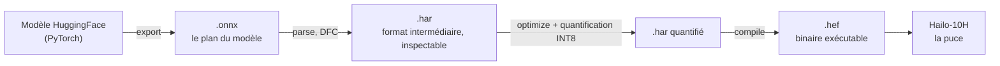
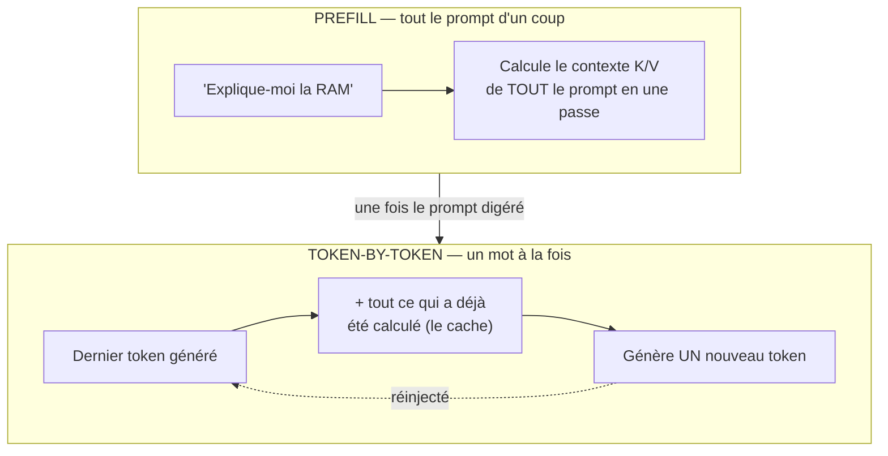
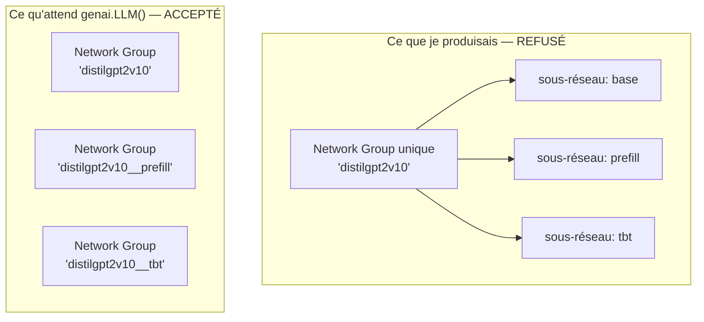
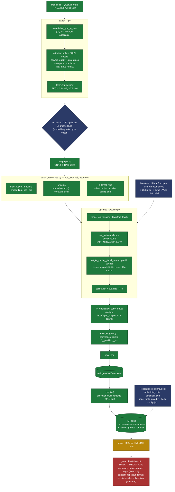

# Compiler un LLM sur un Hailo 10H, un shithole sans fond

---

## Pourquoi ce projet

Le [Hailo-10H](https://hailo.ai/products/ai-accelerators/hailo-10h-ai-accelerator/), c'est le NPU que Hailo vend pour faire tourner des LLM sur du Raspberry Pi 5 (et autres SBC). Contrairement à ses cousins orientés vision, celui-là est pensé dès le silicium pour ça : 8 Go de LPDDR4 embarqués à bord !

Dans un premier temps, j'ai testé ma puce avec [hailo-ollama](https://github.com/hailo-ai/hailo_model_zoo_genai), le "Ollama-like" maison de Hailo qui pilote leurs modèles précompilés. Je me suis amusé deux minutes, et je me suis vite fait chier. Les modèles proposés sont lents, et surtout limités à une liste bien précise :

- [Qwen/Qwen3-VL-2B-Instruct](https://hailo.ai/products/hailo-software/model-explorer/generative-ai/qwen3-vl-2b-instruct/)
- [Qwen/Qwen3-1.7B-Instruct](https://hailo.ai/products/hailo-software/model-explorer/generative-ai/qwen3-1-7b-instruct/)
- [Qwen/Qwen2-1.5B-Instruct-Function-Calling-v1](https://hailo.ai/products/hailo-software/model-explorer/generative-ai/qwen2-1-5b-instruct-function-calling-v1/)
- [meta-llama/Llama3.2-1B-Instruct](https://hailo.ai/products/hailo-software/model-explorer/generative-ai/llama3-2-1b-instruct/)
- [Qwen/Qwen2-1.5B-Instruct](https://hailo.ai/products/hailo-software/model-explorer/generative-ai/qwen2-1-5b/)
- [Qwen/Qwen2-VL-2B-Instruct](https://hailo.ai/products/hailo-software/model-explorer/generative-ai/qwen2-vl-2b/)
- [Qwen/Qwen2.5-1.5B-Instruct](https://hailo.ai/products/hailo-software/model-explorer/generative-ai/qwen2-5-1-5b/)
- [Qwen/Qwen2.5-Coder-1.5B-Instruct](https://hailo.ai/products/hailo-software/model-explorer/generative-ai/qwen2-5-coder-1-5b-instruct/)
- [deepseek-ai/DeepSeek-R1-Distill-Qwen-1.5B](https://hailo.ai/products/hailo-software/model-explorer/generative-ai/deepseek-r1-distill-qwen-1-5b/)

Soit, dans les grandes lignes, une déclinaison de Qwen et un seul Llama. Les images ci-dessous viennent du [Model Explorer de Hailo](https://hailo.ai/products/hailo-software/model-explorer/generative-ai/)

Sauf qu'aujourd'hui, il existe des modèles bien plus intéressants à faire tourner sur 8 Go de RAM que ce catalogue figé:

- [HuggingFaceTB/SmolLM3-3B](https://huggingface.co/HuggingFaceTB/SmolLM3-3B)
- [google/gemma-4-E2B-it](https://huggingface.co/google/gemma-4-E2B-it)
- [LiquidAI/LFM2.5-2.6B](https://huggingface.co/LiquidAI/LFM2.5-2.6B)

Et ayant déjà réussi à compiler des modèles prédictifs pour un Hailo-8L par le passé (voir [mon article sur le sujet](/posts/hailo8l-npu/)), je me suis dit que j'allais tenter la même chose, mais pour des LLM, sur le Hailo-10H.

Et c'est ici que tout commence.

Compiler *son propre* modèle avec le Dataflow Compiler (DFC) public, en dehors du catalogue officiel, c'est officiellement **pas supporté** par Hailo.

J'ai un défaut assez pratique dans ce genre de situation : je supporte mal qu'on me vende un outil et qu'on me dise ensuite de n'en utiliser qu'un dixième. Si le silicium sait faire tourner des LLM, et que le compilateur public a un mot "LLM" quelque part dans son code, j'ai besoin de savoir pourquoi ça ne marcherait QUE pour la liste de modèles que **Hailo** a bien voulu choisir. Soit c'est une vraie limite technique, soit c'est une frontière commerciale tracée à la craie — et dans ce cas-là, elle s'enjambe. Donc j'ai pris un de ces modèles plus récents, et j'ai essayé de le faire rentrer dans le même moule qu'un modèle officiel, sans une ligne de doc pour m'aider, parce qu'**Hailo** n'en fourni pas.

---

## C'est quoi, concrètement, tout ce bordel

Petite mise à niveau avant d'attaquer le vif du sujet. Je ne pars pas du principe que tout le monde a déjà bidouillé un NPU ou lu un papier sur les LLM, donc autant poser le vocabulaire une bonne fois pour toutes.

**Un NPU (Neural Processing Unit)** ne sait faire qu'une chose : exécuter un réseau de neurones déjà entraîné, vite et avec très peu d'électricité. Pas d'entraînement, pas de calcul généraliste comme un CPU, pas de rendu 3D comme un GPU. Juste de l'**inférence** (faire tourner un modèle pour obtenir une réponse), en enchaînant des multiplications de matrices en boucle. Le [Hailo-10H](https://hailo.ai/products/ai-accelerators/hailo-10h-ai-accelerator/) est de cette famille-là, format carte fille pour Raspberry Pi 5.

**Le Dataflow Compiler (DFC)** est l'outil Hailo qui transforme un modèle entraîné classique en binaire que le NPU sait exécuter. Fermé, x86_64 uniquement, dispo sur leur [Developer Zone](https://hailo.ai/developer-zone/). Trois formats se succèdent dans ce pipeline :



- **[ONNX](https://onnx.ai/)** : un format d'échange standard, indépendant de PyTorch/TensorFlow. "Le plan" du modèle, que n'importe quel compilateur sait lire.
- **HAR (Hailo Archive)** : un `.tar` maison, avec le réseau en JSON (lisible, éditable) et ses poids à côté. Le format de travail entre le parse et la compilation.
- **HEF (Hailo Executable Format)** : le binaire final, celui qu'on envoie sur la puce.

Il y a aussi un vocabulaire propre aux **LLM** (Large Language Model, le genre de modèle derrière ChatGPT ou Qwen) qu'il vaut mieux avoir en tête pour la suite. Un LLM génère du texte un mot après l'autre (enfin, un "token", un bout de mot), et il fonctionne selon deux régimes bien distincts :



- **Prefill** : la première passe, qui avale tout le prompt d'un coup.
- **Token-by-token (tbt)** : chaque mot généré ensuite, un par un, en réutilisant ce qui a déjà été calculé plutôt que de tout refaire.
- **KV-cache** : la mémoire de ce qui a déjà été calculé (les "clés" et "valeurs" de l'attention, K et V). Sans elle, générer le 500ᵉ mot reviendrait à recalculer les 499 précédents à chaque fois.

Le DFC compile littéralement deux réseaux séparés, un par régime. C'est un des trucs les plus contre-intuitifs de tout ce projet, et ça va revenir souvent dans la suite.

Le reste du vocabulaire technique qui va traîner dans tout l'article, en une seule table pour ne pas avoir à le redéfinir à chaque round :

| Terme | Définition rapide |
|---|---|
| **NPU** | Puce spécialisée pour exécuter des réseaux de neurones, optimisée pour l'inférence — pas d'entraînement. |
| **DFC (Dataflow Compiler)** | L'outil fermé de Hailo qui compile un modèle (ONNX) vers le binaire exécutable `.hef`. |
| **ONNX** | Format d'échange standard pour un modèle entraîné — "le plan", indépendant du framework d'origine. |
| **HAR (Hailo Archive)** | Format intermédiaire — un `.tar` avec le réseau en JSON et ses poids, inspectable et éditable à la main. |
| **HEF (Hailo Executable Format)** | Le binaire final, celui qui tourne réellement sur la puce. |
| **Prefill / Token-by-token (tbt)** | Les deux régimes d'un LLM en génération : tout le prompt d'un coup, puis un mot à la fois. |
| **KV-cache** | La mémoire de ce qui a déjà été calculé (clés/valeurs de l'attention), pour ne pas tout refaire à chaque mot. |
| **MHA (Multi-Head Attention)** | Attention "classique" : chaque tête a ses propres clés/valeurs, aucun partage. |
| **GQA (Grouped-Query Attention)** | Variante qui fait partager les clés/valeurs entre plusieurs têtes, pour économiser de la mémoire. |
| **QK-Norm** | Une normalisation par tête d'attention, présente sur certains modèles (Qwen3) — casse un motif que le parser Hailo reconnaît. |
| **RoPE (Rotary Position Embedding)** | La méthode la plus courante pour encoder la position d'un token, via des angles cos/sin. |
| **Quantification (INT8)** | Réduire la précision des poids (de flottant à entier 8 bits) pour que le modèle tienne et tourne vite sur la puce. |
| **Network group** | Une unité de déploiement dans un `.hef` — un LLM `genai` en a plusieurs, dont un doit être nommé `*__prefill`. |
| **`genai.LLM()`** | L'API haut niveau du runtime Hailo, celle qui pilote un LLM déjà compilé — le vrai gate de ce projet. |

---

## Round 1 : installer le dernier DFC et refaire ce que je connais déjà

J'ai commencé par installer la dernière version du Dataflow Compiler (5.3.0), le même outil fermé, x86_64 only, que j'avais déjà dompté pour l'article Hailo-8L :

```bash
pip install hailo_dataflow_compiler-5.3.0-py3-none-linux_x86_64.whl
hailo --version
```

Et j'ai voulu appliquer bêtement la même recette que sur le 8L : `ONNX -> HAR -> HEF`. Sur MNIST, ça se résumait à trois appels de `ClientRunner` et basta. Pour un LLM il me manquait un ingrédient, alors avant même de toucher à un vrai modèle, j'ai fouillé le SDK Python du DFC (`hailo_sdk_client`, pas obfusqué, du Python lisible tel quel) pour comprendre comment le catalogue officiel gérait le KV-cache.

Et là, trouvaille : un pass interne nommé `DuplicateLLMToNetworkGroups` tourne systématiquement pendant l'optimize, mais s'éteint tout seul si un paramètre précis n'a pas été renseigné. Ce paramètre est une commande de model-script qui n'est documentée nulle part pour cet usage :

```python
set_kv_cache_global_params(prefill_size, cache_size)
```

Une ligne, planquée dans la doc générique du model-script. C'est le déclencheur unique de toute la mécanique prefill/tbt/KV-cache. Le DFC public, celui que n'importe qui télécharge gratuitement, sait déjà tout faire ; c'est juste que personne ne le dit nulle part. J'en ai fait le cœur de mon propre outil, `recipe.py`, réutilisé tel quel sur tout le reste du projet :

```python
def optimize_llm(runner, prefill_size, cache_size, calib,
                 optimization_level=0, extra_script="", har_out=None):
    """Active le pass LLM et quantifie."""
    script = (
        f"model_optimization_flavor(optimization_level={optimization_level})\n"
        f"set_kv_cache_global_params({prefill_size}, {cache_size})\n"
        f"{extra_script}"
    )
    runner.load_model_script(script)
    runner.optimize(calib)
    if har_out:
        runner.save_har(har_out)
    return runner
```

J'ai vérifié que ça marchait vraiment sur un cas jouet minimal, une seule tête d'attention et rien d'autre : trois scopes après optimisation (base, prefill, tbt), des couches de cache insérées automatiquement, et un `.hef` dont le header binaire est identique, octet pour octet dans sa structure, à celui d'un `.hef` officiel. La mécanique de base marche.

Restait à la faire tenir sur un vrai modèle. Naïvement, je pensais que ce serait la partie facile.

---

## Et là, ça a commencé à partir en couille

Premier essai, avec Qwen3-0.6B parce que c'est celui que je connaissais le mieux et qui me semblait une bonne piste de départ. `translate_onnx_model` a explosé direct :

```
ValueError: Unspecified inputs: {'attention_mask'}
```

Mon export ONNX avait deux entrées, les embeddings et le masque d'attention, et le parser Hailo exige que **toutes** les entrées soient déclarées avec une forme statique, aucun axe dynamique toléré. J'ai fini par figer le masque causal en constante directement dans le wrapper d'export, pour ne laisser qu'une seule entrée pilotable (`inputs_embeds`). Celui-là, c'était le mur facile.

Le deuxième est arrivé tout de suite après, sur l'attention elle-même :

```
UnexpectedNodeError: Expand (self_attn/Expand)
UnsupportedShuffleLayerError: Reshape (self_attn/Reshape_3)
```

Qwen3, comme la plupart des LLM récents, utilise du **GQA** (Grouped-Query Attention) : plusieurs têtes Q partagent les mêmes têtes K/V pour économiser de la mémoire. Cette duplication dynamique des K/V (`repeat_kv` côté PyTorch, un `Expand` une fois exporté en ONNX) n'est simplement pas un motif que le frontend Hailo sait traduire. J'ai fini par matérialiser physiquement le GQA en MHA à l'export, en répétant les poids K/V pour que chaque tête Q ait sa propre copie au lieu de les partager dynamiquement. Ça coûte de la mémoire, mais l'export n'émet alors plus aucun `Expand`, et ce mur-là tombe aussi.

Le troisième, en revanche, ne tombera pas :

```
UnsupportedShuffleLayerError: Reshape (self_attn/Reshape_1)
```

Sur les 28 couches de Qwen3, le même reshape casse à chaque fois : celui qui isole les têtes d'attention, `[1,32,2048] -> [1,32,16,128]`. Hailo reconnaît le motif "un `reshape` collé directement à un `transpose`" et le fusionne en une simple conversion de format 4D. Sauf que Qwen3 a un **QK-Norm**, une normalisation appliquée par tête, glissée entre le reshape et le transpose, et dès qu'un opérateur s'intercale entre les deux, le motif casse et le parser abandonne. J'ai perdu un temps monstrueux à croire que c'était un problème de shapes dynamiques à figer quelque part. C'était en fait un mur d'architecture, pas un réglage à trouver.

Trois murs francs pour un seul modèle, et le troisième bloque tout net. Autant dire que "suivre la même logique que le Hailo-8L" a duré à peu près le temps de comprendre ce paragraphe.

---

## Round 2 : dégager Qwen3, prendre un modèle sans QK-Norm

Face à un mur d'architecture, il y a deux options : réécrire le forward d'attention en layout 4D Hailo-friendly (chantier lourd, aucune garantie que ça marche), ou changer de cible pour valider l'hypothèse d'abord voir si le reste tient debout. J'ai pris la deuxième option, changer de cible pour voir si le reste du plan tenait debout, et je suis passé sur Qwen2.5-0.5B, même famille mais sans QK-Norm.

Ça a confirmé l'hypothèse tout de suite : sans QK-Norm, le `reshape` et le `transpose` redeviennent adjacents, Hailo les fusionne en conversion de format, et le `UnsupportedShuffleLayerError` disparaît. C'était bien le QK-Norm qui cassait le motif, rien d'autre.

Sauf que dès que j'ai essayé de parser le modèle complet (24 couches, pas juste un bloc jouet), nouveau mur :

```
NetworkXUnfeasible: Graph contains a cycle
```

Celui-là venait de Hailo lui-même : le DFC désactive sa propre simplification ONNX interne sur les "gros" modèles, et avec un vocabulaire de 151936 tokens, le `lm_head` suffit à basculer dans cette catégorie. J'ai dû simplifier le graphe moi-même, en amont, avec `onnx-simplifier` :

```bash
python -m onnxsim qwen_body.onnx qwen_body_sim.onnx --no-large-tensor
```

Et là, premier vrai résultat : un bloc transformer Qwen2 complet (RMSNorm, RoPE, attention, MLP SwiGLU) parse et compile intégralement. `q1plain.hef`, 13 Mo, sans cache pour l'instant.

L'étape suivante logique était de réactiver `set_kv_cache_global_params` sur ce même bloc. L'optimize et la quantification passent sans broncher, mais le compile plante :

```
Invalid kernel shape for conv down_proj, Groups: 0
```

Celui-là, impossible de le contourner en changeant de modèle : il fallait comprendre ce qui se passait vraiment dans le `.hn` (le JSON qui décrit le réseau à l'intérieur du HAR). En creusant, j'ai fini par trouver la cause exacte. Sur une conv à connexion résiduelle comme `down_proj` (celle du MLP SwiGLU, qui fusionne la sortie du MLP avec le résidu), le pass de duplication de Hailo réordonne la liste des entrées de la couche sans réordonner la liste des shapes correspondante. Inoffensif quand les deux entrées font la même taille, puisqu'il n'y a alors aucune ambiguïté d'ordre. Fatal quand elles diffèrent, exactement le cas de `down_proj` avec ses 4864→896. Un bug réel dans le pass fermé de Hailo, pas une erreur de configuration de mon côté.

La seule option restait une chirurgie directe du `.hn` : pour chaque conv concernée, réordonner sa liste d'entrées pour que chaque entrée pointe vers la couche dont le nombre de features de sortie correspond bien à ce qu'attend la conv.

```python
def fix_duplicated_conv_inputs(har_in, har_out):
    """Corrige le bug du pass LLM Hailo : `input` désaligné de `input_shapes`
    sur les convs à résidu fusionné après duplication prefill/tbt."""
    hn = load_hn(har_in)                      # extrait le .hn du .tar HAR
    fixed = 0
    for layer in hn["layers"].values():
        if layer.get("type") != "conv":
            continue
        ins, shapes = layer.get("input"), layer.get("input_shapes")
        want = [s[-1] for s in shapes]          # feature count attendu, par position
        got = [feature_count(n) for n in ins]   # feature count réel, dans l'ordre actuel
        if got == want:
            continue
        layer["input"] = reorder_to_match(ins, want)   # réaligne input <-> input_shapes
        fixed += 1
    save_hn(hn, har_out)
    return fixed
```

(Version condensée ici, le vrai script `recipe.py` fait le tour du `.tar` du HAR à la main, sans dépendance externe.) Une fois ce correctif appliqué, le même bloc Qwen2 compile avec cache cette fois : `q1blk_cache.hef`, 36 Mo, groupes prefill/tbt et couches de cache au complet. Je l'ai réutilisé tel quel sur tous les modèles suivants, 12 convs corrigées à chaque run sur `distilgpt2` (2 par bloc × 6 blocs), un pattern d'une régularité presque suspecte.

Restait à vérifier que tout ça tournait vraiment sur silicium et pas juste sur le papier du compilateur. Direction le Raspberry Pi 5 avec le Hailo-10H branché : `hailortcli run2` sur le bloc sans cache tourne à ~512 FPS sur le NPU, preuve que la chaîne produit bien des modèles exécutables et pas juste des binaires qui passent la compilation. Le bloc avec cache, lui, se fait recaler sèchement :

```
HAILO_INTERNAL_FAILURE
```

`run2` est un banc de test générique, il ne sait pas gérer des couches à état comme le KV-cache, il lui faut un runtime qui comprenne la boucle prefill→tbt. Ce runtime, c'est précisément `genai.LLM()`, celui qu'utilise le catalogue officiel. Ce constat a fait basculer tout l'effort du projet : arrêter d'essayer d'écrire mon propre runtime d'inférence, et comprendre exactement ce que `genai.LLM()` exige d'un `.hef` pour accepter de le charger.

---

## Round 3 : le vrai contrat, celui de `genai.LLM()`

Compiler un bloc qui tourne, c'est une chose. Satisfaire le runtime haut niveau que Hailo fait tourner en interne pour son propre catalogue, c'en est une autre, et rien dans la doc publique ne le décrit. Alors j'ai refait ce qui avait marché pour percer le mécanisme du DFC : aller chercher un artefact officiel et le disséquer plutôt que deviner. J'ai téléchargé le HAR officiel de [Qwen2-1.5B-Instruct](https://huggingface.co/Qwen/Qwen2-1.5B-Instruct), 38 Go qui ne se torrentent pas sur un coin de table, et je l'ai comparé ligne à ligne au mien.

Ce que `genai.LLM()` attend vraiment, que rien dans la doc ne mentionne :

- Le réseau prend en entrée des **IDs de tokens bruts et des positions**, pas des embeddings ou du RoPE précalculés côté hôte. L'embedding et le calcul [RoPE](https://arxiv.org/abs/2104.09864) se font *on-chip*.
- **Quatre ressources** sont embarquées directement dans le `.hef` : la table d'embedding (`embeddings.bin`), le tokenizer (`tokenizer.json`), les angles RoPE (`rope_theta_data.bin`) et un fichier de config JSON (`hailo-config.json` : stop tokens, params de génération par défaut).
- Le contrat officiel Qwen a **6 input layers**, pas 3 : embeddings, masque d'attention, et RoPE cos/sin **séparés pour Q et K** (Q large, K étroit — logique, GQA-aware).
- Le `.hef` doit contenir plusieurs network groups nommés, dont un se terminant littéralement par `__prefill` — celui-là, je ne l'ai découvert que bien plus tard (Round 6), à mes dépens.

Attacher ces ressources se fait avant l'optimize, via `add_external_resources`, une commande du SDK que j'ai dû décoder directement depuis son code source puisqu'elle n'est documentée nulle part pour cet usage. Voici la partie de mon `genai_resources.py` qui construit le canal cos/sin de RoPE :

```python
def rope_theta_angles(head_dim, base):
    inv = 1.0 / (base ** (np.arange(0, head_dim, 2) / head_dim))
    return np.concatenate([inv, inv])                    # [head_dim]

mapping = {f"{scope}/input_layer2": "cos", f"{scope}/input_layer3": "sin"}
weights = {
    f"{scope}/input_layer2": {"tile": [1, 1, n_heads], "factor": 1.0, "theta": theta},
    f"{scope}/input_layer3": {"tile": [1, 1, n_heads], "factor": 1.0, "theta": theta},
}
runner.add_external_resources({
    "input_layers_mapping": mapping,
    "weights": weights,
    "external_files": {"tokenizer.json": tok_path, "hailo-config.json": cfg_path},
})
```

Le runtime `genai` ne feed jamais du cos/sin précalculé, juste des positions entières brutes. C'est la couche `cos`/`sin` elle-même, insérée par cette commande, qui calcule `factor * cos(theta * position)` en interne, à chaque étape de génération.

Détail amusant trouvé en creusant le tutoriel officiel Hailo sur le fine-tuning LoRA, le seul tuto public qui touche à un LLM : il télécharge directement le HAR Qwen 1.5B tout fait, sans jamais montrer l'étape ONNX → HAR. L'étape la plus dure de tout ce projet, Hailo ne la documente nulle part, tout simplement parce qu'elle est strictement interne chez eux. Ce que je devais reproduire de zéro, ils ne l'ont eux-mêmes jamais publié.

---

## Round 4 : repivot sur `distilgpt2`, pour arrêter de me battre sur deux fronts

À ce stade, [SmolLM2-135M-Instruct](https://huggingface.co/HuggingFaceTB/SmolLM2-135M-Instruct), mon modèle de dé-risque, mélangeait deux problèmes distincts : faire fonctionner correctement le GQA sur Hailo, et satisfaire le contrat `genai`. Je n'arrivais jamais à savoir lequel des deux je débuggais réellement.

J'ai fini par changer de modèle pour un qui élimine complètement le premier problème. [`distilgpt2`](https://huggingface.co/distilbert/distilgpt2), 6 couches, 12 têtes, MHA pur, zéro GQA, permet d'isoler exclusivement la question du contrat `genai`, sans bruit architectural. C'est resté le modèle de travail pour tout le reste du projet.

---

## Round 5 : `SEQ = CACHE_SIZE`, et un tour de passe-passe en transformée de Fourier

Après quelques itérations sur l'architecture ONNX (attention QKV scindée en 3 convs séparées, exactement ce que fait aussi le HAR officiel comme je le découvrirai plus tard ; GELU remplacée par son approximation sigmoïde ; masque baké en constante), je suis tombé sur un bug de shape dans le pass de cache. Une division entière qui donne 0 quand la séquence exportée est plus petite que la taille du cache.

En lisant le code du pass interne qui injecte le vrai mécanisme dynamique de cache, j'ai trouvé la vraie règle : il ne s'active sur un matmul que si le deuxième opérande a `input_shape[-2] == cache_size` nativement, au moment du parse. Exporter à `SEQ = prefill_size` en espérant que le pass "agrandisse" tout seul jusqu'à `cache_size` ne marche pas. Il fallait exporter nativement à `SEQ = CACHE_SIZE` : le masque causal garantit que rien n'est perdu numériquement au-delà du prefill réel. Premier HEF KV-cache `distilgpt2` qui compile, 91 Mo. Sauf que `genai.LLM()` timeout à ~2 minutes, les ressources genai étant encore absentes.

Le mur suivant était plus tordu. Le format `genai` ne conserve qu'une seule table d'embedding dans le HEF final, peu importe combien j'en attache. Le hic, c'est que GPT2 a nativement deux tables apprises : celle des tokens (`wte`) et celle des positions (`wpe`), contrairement à Qwen/Llama qui n'ont qu'une table de tokens et encodent la position via RoPE. Impossible de caser les deux.

J'ai fini par sortir l'encodage de position de la table d'embedding pour le faire porter par le canal cos/sin natif de `genai`, normalement réservé à RoPE, via une reconstruction en série de Fourier de la table `wpe` :

```python
fft_coef = np.fft.rfft(wpe_full, axis=0)          # décomposition en fréquences
A[0]  = fft_coef[0].real / N
A[1:] = 2 * fft_coef[1:].real / N
B[1:] = -2 * fft_coef[1:].imag / N
```

Avec assez de fréquences (`K = CACHE_SIZE//2+1`), la reconstruction de `wpe` est quasiment exacte, erreur de l'ordre de 1e-14, un simple aller-retour [FFT](https://en.wikipedia.org/wiki/Discrete_Fourier_transform)/inverse. Un modèle à position apprise réutilise donc le tuyau prévu pour du RoPE, en le détournant un peu. Résultat : cosine 0.999964 sur le forward complet, et surtout, signe que quelque chose bougeait enfin structurellement, le timeout de `genai.LLM()` tombe de ~2 minutes à ~10,3 secondes.

---

## Round 6 : comparer à Qwen change tout

Question évidente à ce stade : et si le nombre de fréquences (`K`) de mon canal cos/sin détourné était la cause du ralentissement ? Un vrai RoPE utilise un `K` petit et fixe (`head_dim/2`, souvent ~32), indépendant de la taille du contexte, alors que le mien montait à 129, voire 257. J'ai forcé `K=32`, au prix d'une reconstruction DFT tronquée donc approximative (cosine 0.999443 au lieu de 0.999972). HEF produit en 1h23 de compile, et... timeout à 10,243 secondes. Quasi identique. Hypothèse invalidée.

Ce résultat négatif, aussi frustrant soit-il, a fini par débloquer la vraie question : pourquoi un temps aussi constant, peu importe la taille du HEF ou le nombre de fréquences ? La réponse est venue d'une comparaison toute bête. J'ai chargé le `.hef` officiel Qwen2-1.5B-Instruct, 1,7 Go, 13 fois plus gros que le mien, sur le même Pi5. Temps de chargement : 4,55 secondes. Plus petit, plus gros, peu importe, mon HEF était structurellement différent du sien à contrat presque égal. Ce n'était donc ni une question de taille ni de bande passante PCIe.

La réponse s'est trouvée là où je n'avais pas encore regardé : les logs du firmware embarqué sur la puce elle-même. Le Hailo-10H fait tourner son propre mini-Linux, confirmé via `dmesg` côté Pi5, qui charge `customer_certificate.bin`, `scu_fw.bin`, `u-boot-spl.bin`, une `fitImage` complète au boot. `hailortcli logs runtime` expose ses logs directement :

```
[llm_inference_manager.cpp:31] [create] CHECK failed - Model doesnt have NG with name-suffix '__prefill'
[llm_server.cpp:201] [operator()] CHECK_SUCCESS failed with status=HAILO_INTERNAL_FAILURE(8)
```

Mon HEF ne contenait qu'un seul network group fourre-tout, qui bundlait les trois scopes (base/prefill/tbt) comme trois sous-réseaux internes, au lieu de plusieurs groupes séparés dont un dont le nom doit se terminer littéralement par `__prefill`. C'est ça que le firmware cherchait, et ne trouvait jamais, depuis le tout premier compile.



En grepant le code source du DFC plutôt qu'en relançant un énième compile à l'aveugle, j'ai fini par trouver la commande de model-script qui permet de le forcer explicitement : `network_group(<scopes>)`. Premier essai avec des noms de mon cru (`prefill_ng`, `tbt_ng`...) : structure enfin correcte, 3 groupes bien formés, vérifié via `hailortcli parse-hef`. Mais `genai.LLM()` timeout encore avec la même erreur, parce que le firmware fait littéralement `name.endswith("__prefill")`, et `prefill_ng` ne matche évidemment pas. Il a fallu renommer les groupes exactement comme les scopes existants (`distilgpt2v10__prefill`, etc.) pour que ça passe pour de bon.

---

## Round 7 : un nouveau mur, et une règle que je me suis imposée

Blocage de nommage réglé, `genai.LLM()` avance enfin plus loin que jamais, jusqu'à un nouveau silence de ~10 secondes, puis `HAILO_TIMEOUT`, sans une ligne de log entre les deux.

Ma première tentation a été de patcher directement en mémoire les constantes de timeout dans le binaire fermé `libhailort.so`. Zéro effet, malgré un chargement confirmé. Et pour cause, une fois compris via les headers publics : ces constantes sont déclarées `constexpr` en C++, donc inlinées comme valeur immédiate à chaque site d'appel par le compilateur. La valeur qu'on patche dans le binaire n'est lue nulle part au runtime. Je me suis fixé une règle depuis : reverse-engineering en lecture seule uniquement, headers publics, `strings`, logs verbeux. Comprendre le contrat plutôt que bricoler le symptôme à l'aveugle.

Les headers publics, eux, sont limpides sur la valeur en question :

```cpp
// hailo/genai/llm/llm.hpp
static constexpr std::chrono::milliseconds LLMGeneratorCompletion::DEFAULT_READ_TIMEOUT = std::chrono::seconds(10);
```

Dix secondes, pile ce qu'on observe. Un `strace -f -tt` côté client confirme le mécanisme : deux attentes `futex` séquentielles avec un timeout explicite (`ETIMEDOUT` après ~4,6s puis 5,0s pile, total ~9,6s). Pas un deadlock, plutôt un pattern de polling borné dans le temps, le client attend activement une réponse qui n'arrive jamais. J'ai tenté de localiser la fonction exacte via `gdb`, sans succès : `libhailort.so` n'exporte quasiment aucun symbole, des backtraces pleins de `?? ()`, et sous `ptrace` le nombre de futex explose en quelques secondes. Pas moyen de cibler la bonne fenêtre sans symboles de debug que Hailo ne fournit pas.

---

## Round 8 : le masque manquant, quatre échecs, et une découverte de dernière minute

La piste suivante était plus actionnable : le contrat officiel Qwen a 6 input layers, le mien n'en a que 3, et le masque d'attention est baké en constante depuis le Round 5, jamais passé en vrai input. Et si c'était exactement ce que le runtime attendait et ne trouvait pas ?

Quatre tentatives m'ont mené à quatre échecs, pour la même raison déguisée à chaque fois :

1. **v14** — masque naïf `[1,1,SEQ,SEQ]` en vrai input ONNX. `optimize()` explose (`InvalidInputShape`), le parser traite les deux dernières dimensions comme deux dimensions spatiales.
2. **v15** — masque correctement tuilé à la forme officielle (têtes repliées dans le canal, pas en spatial), câblé à la main via `Slice`+`Add`. Ça casse quand même, cette fois parce que la fusion automatique que Hailo applique pour un masque constant ne s'applique plus à un vrai input.
3. **v16** — laisser la directive `set_input_mask_to_softmax()` du model-script faire elle-même la chirurgie sur un masque "flottant" dans le graphe. Soit `torch.onnx.export` élague l'input silencieusement parce qu'il n'est jamais vraiment utilisé dans le calcul, soit le parser Hailo le rejette (`Couldn't find inputs from ONNX proto`).
4. **v17** — reconstruction exacte de la recette officielle Qwen, décomposée layer par layer depuis leur HAR (masque multiplicatif 1/0, pas additif `-inf`, encore un écart trouvé au passage). Export propre, cosine 0.999448... et le même échec, à l'identique.

Quatre formulations différentes du même masque, quatre échecs identiques. Ce n'était donc pas la formulation qui posait problème, mais la simple présence d'un vrai tenseur d'entrée intersectant le calcul d'attention.

La sortie de crise est venue d'une suggestion aussi simple qu'évidente : chercher un paramètre du parser avant de se lancer dans une chirurgie manuelle du `.hn`. `translate_onnx_model` a un paramètre `net_input_format`, jamais rencontré jusque-là, dont la docstring révèle la vraie cause. Par défaut, un input de rang 4 est interprété en `NCHW` (canaux en 2e position). Mon masque `[1,1,SEQ,NHEAD*SEQ]` était donc lu comme `canal=1, hauteur=SEQ, largeur=NHEAD*SEQ`, les deux vraies dimensions comprises comme spatiales. La cause unique des quatre échecs précédents, indépendante de tout ce que j'avais essayé de bricoler côté masque.

```python
runner.translate_onnx_model(
    "model.onnx", "m",
    net_input_format={"attention_mask": [Dims.BATCH, Dims.HEIGHT, Dims.WIDTH, Dims.CHANNELS], ...},
)
```

Résultat : plus aucun matmul avec une grille spatiale parasite, exactement propre, comme sans masque du tout. La suite du pipeline est en cours au moment où j'écris ces lignes.

---

## Où j'en suis

Concrètement, le mur du nommage des network groups (Round 6) est résolu, et le dernier problème structurel identifié côté parser ONNX (Round 8, `net_input_format`) a une correction qui marche numériquement. Ce que je n'ai pas encore confirmé, c'est si ce correctif fait réellement tomber le timeout de 10 secondes une fois repassé par tout le pipeline : optimize, quantification, compile, et un vrai test `genai.LLM()` sur le Pi5.

Voici une vue d'ensemble de toute la chaîne, telle qu'elle tient aujourd'hui : vert pour ce qui est validé, orange pour ce qui tourne mais bloque encore, rouge pour le point de blocage précis.



Ce projet n'a jamais eu de date de fin fixée à l'avance, et ce n'est pas cet article qui va en inventer une. Je continue à creuser, et la suite (que ça marche, ou que je tombe sur un mur encore plus haut) fera l'objet d'un prochain article.

---

*Cet article a été rédigé avec l'aide de Claude, à partir de mes notes techniques brutes. Tout ce qui y est écrit peut donc contenir des erreurs, des raccourcis ou des approximations.*