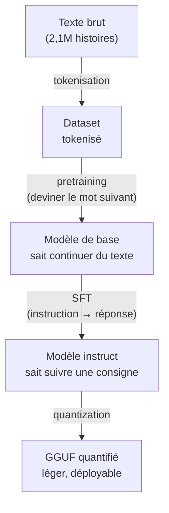

---

## Pourquoi ce projet ?

Dans [le post précédent](/posts/testing-weird-ai-configs/), j'ai fini par faire tourner de l'inférence sur une Tesla T10 récupérée pour 300€ — une carte qui, dans une autre vie, streamait du cloud gaming chez GeForce Now. Sympa, mais soyons honnêtes deux secondes : faire tourner un modèle que quelqu'un d'autre a entraîné, c'est le service minimum syndical. N'importe qui avec `ollama pull` sait faire ça en trente secondes.

Ce qui me démangeait, c'était la partie d'avant. D'où sort le modèle. Comment on passe d'un tas de texte brut à un truc qui aligne des phrases qui tiennent debout. Et si t'utilises Claude, ChatGPT ou Mistral tous les jours, y'a de bonnes chances que tu ne te sois jamais posé la question sérieusement : tu tapes un prompt, ça sort une réponse, et entre les deux c'est de la magie noire pour à peu près tout le monde qui s'en sert.

Ce projet, c'est l'anti-magie noire. Est-ce que je suis capable de faire tourner *tout* le pipeline moi-même, du texte brut jusqu'au modèle quantifié prêt à déployer, sans passer par nanoGPT ou un `AutoModel.from_pretrained()` qui fait le sale boulot à ma place ?

Spoiler : oui. Mais pas sans me prendre un bug bien vicieux dans la gueule au passage. J'y reviens, il le mérite amplement.

Le pipeline complet tient en quatre étapes :



**Dataset → Pretraining → SFT → PTQ.** Quatre sections, un article. Et tout ça sur la T10, en Docker, pour ne pas transformer hpc1 en poubelle de dépendances Python à chaque expérience foireuse.

---

## Le setup

Rien de neuf côté hardware par rapport au post précédent — toujours la même workstation HP Z440 et sa Tesla T10 (Turing, compute capability 7.5, 15,6 Go de VRAM). Ce qui change, c'est que cette fois tout passe par [Docker](https://docker.com) + le [NVIDIA Container Toolkit](https://docs.nvidia.com/datacenter/cloud-native/container-toolkit/latest/index.html), pour pouvoir tout jeter et recommencer sans laisser de merde sur le système.

```bash
docker run --rm --gpus '"device=0"' pytorch/pytorch:2.6.0-cuda12.4-cudnn9-runtime \
  python -c "import torch; print(torch.cuda.get_device_name(0))"
# Tesla T10
```

Petit détail qui a son importance pour la suite : la T10 c'est du **Turing**, donc des Tensor Cores en **fp16**, mais pas de bf16 natif (arrivé seulement avec Ampere). Tout l'entraînement tourne donc en `torch.autocast` fp16 + `GradScaler`, pas en bf16 comme tu ferais par réflexe sur une carte plus récente.

---

## Le dataset

Pour un pretraining from scratch qui tienne dans une soirée plutôt que dans un mois, il fallait un dataset petit et simple. J'ai pris **[TinyStories](https://huggingface.co/datasets/roneneldan/TinyStories)** : un corpus de contes générés par GPT-3.5/4 avec un vocabulaire volontairement restreint, conçu par Microsoft Research pile pour prouver qu'un tout petit modèle peut sortir du texte cohérent.

Petite parenthèse pour ceux qui n'ont jamais mis les mains là-dedans : un LLM ne lit pas du texte lettre par lettre comme toi. Avant de rentrer quoi que ce soit dans le modèle, il faut découper le texte en petits morceaux appelés **tokens** — parfois un mot entier, parfois juste un bout de mot, parfois un seul caractère. L'outil qui fait ce découpage s'appelle un **tokenizer**, et le **vocab_size** c'est simplement le nombre de tokens différents qu'il connaît. La méthode la plus courante pour le construire s'appelle le **BPE** (Byte Pair Encoding) : en gros, tu pars des caractères bruts, et tu fusionnes petit à petit les paires qui reviennent le plus souvent dans ton corpus, jusqu'à obtenir un vocabulaire de la taille voulue. Plus ce vocabulaire est petit, plus le modèle croise souvent les mêmes tokens pendant l'entraînement — pratique quand ton corpus est volontairement simple comme TinyStories.

2 119 719 histoires pour l'entraînement, 21 990 pour la validation. J'ai entraîné mon propre tokenizer BPE byte-level dessus (vocab_size 8192, via la lib `tokenizers` de HuggingFace — écrire un BPE trainer complètement à la main aurait été un chantier à part entière, donc là je fais une exception) puis tout tokenisé dans deux gros fichiers binaires `uint16`, chargeables en `memmap` pendant l'entraînement sans tout faire tenir en RAM :

```
train.bin: 466 602 707 tokens (890 Mo)
val.bin:     4 689 785 tokens (9 Mo)
```

Téléchargement HuggingFace, entraînement du tokenizer, encodage des 2,1M histoires : tout ça, c'est du CPU pur et dur. Aucune matmul, donc la T10 reste à 0% pendant que je regarde une barre de progression pendant 16 minutes. Ça fait partie du folklore : on croit lancer un truc GPU et en fait on attend juste que Python finisse une boucle for.

---

## Le modèle : un GPT decoder-only écrit à la main

Ici, pas de nanoGPT, pas de `transformers.GPT2Model`. Un transformer decoder-only classique, construit brique par brique dans un seul fichier `model.py`.

Pour ceux qui n'ont jamais ouvert le capot d'un transformer : le cœur du mécanisme, c'est l'**attention**. C'est ce qui permet à chaque mot de "regarder" les mots qui le précèdent et de décider lesquels comptent pour deviner la suite. Dans "le chat mange sa ___", le modèle doit comprendre que "chat" et "mange" pèsent plus lourd que "le" pour deviner "gamelle" plutôt que n'importe quoi d'autre. **Multi-tête**, ça veut dire qu'il fait ce calcul plusieurs fois en parallèle, avec des "angles" différents à chaque fois, pour capter plusieurs types de relations entre les mots simultanément. **Causale**, ça veut dire qu'un mot ne peut regarder QUE ce qui vient avant lui, jamais ce qui vient après — sinon le modèle trichererait en lisant la réponse avant de l'avoir devinée, et l'entraînement ne voudrait plus rien dire.

Le détail de ce qui a été codé à la main, sans raccourci :

- **Embeddings** token + position
- **Attention causale multi-tête**, codée à la main : projections QKV, scores `QKᵀ/√head_dim`, masque triangulaire causal précalculé, softmax — pas de kernel fusionné, pas de flash-attention, du PyTorch pur et dur
- **MLP** classique derrière chaque bloc d'attention, pour digérer ce que l'attention a repéré (expansion ×4, GELU, projection retour) — rien de plus exotique que deux couches linéaires avec une activation entre les deux
- **Pre-norm** partout (LayerNorm *avant* l'attention/le MLP plutôt qu'après) — c'est ce qui entraîne le plus stablement un petit modèle sans passer des heures à tuner le warmup
- **Weight tying** entre l'embedding d'entrée et la tête de sortie — les deux partagent littéralement la même matrice de poids, ce qui réduit le nombre de paramètres et aide un petit modèle à mieux généraliser

Config finale : 8 couches, 8 têtes, dimension 512, contexte de 256 tokens. **29,5 millions de paramètres.** Un poids plume comparé à n'importe quel LLM du commerce (GPT-4 ou Claude tournent avec plusieurs ordres de grandeur de paramètres en plus), mais amplement suffisant pour ce qu'on lui demande.

Petit test de sanité avant de se lancer : à l'initialisation, sans le moindre entraînement, la loss était de 9.20 — cohérent avec `ln(8192) ≈ 9.01`, la loss théorique d'un modèle qui prédit au hasard sur les 8192 tokens du vocabulaire. Toujours satisfaisant de voir les maths tomber juste avant même d'avoir entraîné quoi que ce soit.

---

## Le pretraining

Petite parenthèse encore, parce que ça va revenir tout du long : la **loss**, c'est une seule note qui résume à quel point le modèle se plante en moyenne à chaque mot qu'il essaie de deviner. Plus c'est bas, mieux c'est. Elle part forcément haute (le modèle sort n'importe quoi au hasard, comme on vient de le voir) et elle est censée descendre au fur et à mesure qu'il apprend des régularités dans le texte.

Boucle d'entraînement maison : `AdamW`, warmup linéaire suivi d'un cosine decay, fp16 + `GradScaler`, gradient clipping. Un smoke test à froid sur 20 itérations donnait ~48k tokens/s — de quoi estimer qu'une **epoch** complète (le modèle voit chaque exemple du dataset une fois, pas plus) sur les 466M tokens prendrait dans les 2h40.

J'ai lancé le run complet en conteneur détaché (`docker run -d`), parce que couper une session SSH au milieu d'un entraînement de plusieurs heures pour perdre le boulot, très peu pour moi.

Le débit réel s'est stabilisé autour de **71 000 tokens/s** une fois le warmup CUDA passé — largement au-dessus de l'estimation à froid. Une epoch complète, **1h49** au lieu des 2h40 prévues.


Train et val se superposent quasiment parfaitement du début à la fin. Logique : avec 466M tokens vus une seule fois, le modèle n'a jamais l'occasion de revoir un exemple, donc zéro surapprentissage possible. La loss finale atterrit à **1.66**, contre 9.17 au départ.

Et surtout, ça marche. Un prompt "Once upon a time" balancé au modèle fraîchement pretrainé :

> *Once upon a time there was a little girl. She was very small and wanted to find a way out. The little girl looked all around her. She searched high and low, but she couldn't find anything. Then, she saw a big bird's nest in the tree. [...]*

Grammaticalement correct, cohérent sur plus de cent tokens, pile dans le style TinyStories. Pour 29,5M de paramètres entraînés en moins de deux heures sur une carte de cloud gaming reconvertie, je trouve ça franchement pas dégueulasse.

---

## Le fine-tuning (SFT)

Parenthèse importante ici, probablement le truc le moins connu de tous ceux qui utilisent l'IA sans avoir jamais mis le nez dedans : ce qu'on vient de pretrainer, c'est ce qu'on appelle un modèle **base**. Si tu lui donnes "Quelle est la capitale de la France ?", il ne va pas te répondre "Paris". Il va probablement continuer la phrase comme un exercice de grammaire scolaire, genre "... et quelle est la capitale de l'Allemagne ? Et de l'Italie ?". Un modèle base ne sait faire qu'une chose : deviner le mot suivant le plus probable, point barre. Pas de conversation, pas d'assistant, juste de l'autocomplete glorifié.

Le SFT (**S**upervised **F**ine-**T**uning), et derrière lui souvent du RLHF (qu'on ne fait pas ici, ce serait un article entier à part), c'est ce qui transforme cette machine à continuer du texte en un truc qui a l'air de te "répondre". Concrètement : ChatGPT, Claude, Mistral, tout ce que t'utilises au quotidien, c'est un modèle base qui a subi ce genre de traitement, en très, très, très poussé. Sans cette étape, pas de conversation. Juste un perroquet statistique qui continue tes phrases.

Je voulais que mon modèle suive une instruction — genre "écris une histoire qui contient tels mots" — sans passer par Alpaca (le dataset d'instructions généraliste habituel), parce que son vocabulaire n'a rien à voir avec celui, volontairement riquiqui, de TinyStories. Un modèle qui n'a jamais vu le mot "photosynthèse" n'apprendra rien d'utile à essayer de répondre dessus.

Solution : construire le dataset d'instructions **à partir de TinyStories lui-même**. Pour chaque histoire, je prends trois de ses propres mots au hasard, et je fabrique une paire `"Écris une histoire avec ces mots : X, Y, Z." → l'histoire`. La loss est masquée sur la partie instruction, pour que le modèle n'apprenne qu'à produire l'histoire, pas à mémoriser la formulation de la consigne.

Premier run lancé. Et là, alerte rouge : la val loss s'effondre à **0.0001** en quelques centaines d'itérations. Pour un modèle de langage, une loss aussi basse ne veut jamais rien dire de bon — soit il a mémorisé tout le dataset par cœur (peu probable en si peu de steps), soit il y a un bug quelque part. Je génère une histoire avec le checkpoint tout frais pour vérifier : des lignes vides, puis une boucle infinie de guillemets. Rien d'exploitable, même en donnant au modèle le prompt *exact* d'un exemple d'entraînement. Merde. Ça sentait le bug à plein nez, pas le miracle.

En creusant, la loss que je mesurais n'était même pas celle que je croyais mesurer. Dans le script de préparation des données, j'avais fait `labels = list(ids)` — une copie **à l'identique** de la séquence d'entrée, sans décalage d'un cran. Sauf que `model.forward()` ne décale rien tout seul : c'est à l'appelant de fournir des cibles déjà alignées sur "la sortie à la position i doit prédire le token à la position i+1" (exactement ce que fait `get_batch` dans le pretraining, via un simple offset dans le tableau memmap). Résultat : je demandais au modèle de prédire, à chaque position, **le token qu'il venait tout juste de recevoir en entrée** à cette même position. Une tâche de copie complètement débile, presque résoluble par l'embedding seul vu que l'entrée et la sortie partagent leurs poids (*weight tying*, tu te souviens ?). D'où la loss ridiculement basse. D'où le modèle qui ne savait plus rien branler une fois livré à lui-même en génération.

Le genre de bête erreur qui ne saute pas aux yeux tant que tu n'as pas comparé l'argmax et la vraie cible sur un exemple précis. Fix en une ligne (`labels[i] = ids[i+1]`, avec le masquage qui va bien), régénération du dataset, et deuxième run.


Cette fois la val loss oscille entre 1.57 et 1.83 — bruitée (l'éval ne tourne que sur un seul batch à chaque fois, contrairement au pretraining), mais dans la même fourchette que la loss finale du pretraining. Exactement ce qu'on veut voir : le modèle n'apprend pas une tâche disjointe, il apprend juste un format en plus par-dessus ce qu'il savait déjà faire.

Test sur un prompt **jamais vu à l'entraînement** :

> **Write a short story using these words: dog, ball, park.**
>
> *One day, a little dog named Max went for a walk. He saw a big, red ball in the park. Max wanted to play with the ball, so he took it home. Max was very happy. [...]*

Les trois mots imposés sont bien là. Sur un deuxième essai (`mountain, brave, castle`), le modèle utilise "brave" et "castle" mais zappe complètement "mountain", parti sur une histoire de chevalier et de dragon à la place. Suivi d'instruction réel, mais imparfait — cohérent pour un modèle de 29,5M de paramètres, et je préfère montrer ce résultat-là plutôt que de ne garder que le premier essai qui marchait pile poil.

---

## La quantization (PTQ)

Encore une parenthèse pour ceux qui utilisent des LLM en local sans trop savoir ce qui se passe sous le capot : les poids d'un modèle, c'est juste des milliards de nombres à virgule. Plus la précision de ces nombres est haute (32 bits, 16 bits...), plus le fichier est gros et plus il faut de VRAM pour le charger. La **quantization**, c'est réduire cette précision (8 bits, 4 bits...) pour diviser la taille du modèle par 2, 3, voire 4, quitte à perdre un chouïa de finesse sur chaque poids individuel. C'est littéralement ce qui permet à Ollama de faire tourner un modèle de plusieurs milliards de paramètres sur ton laptop sans qu'il se transforme en grille-pain.

Dernière étape donc : exporter en **GGUF** (le format de fichier de `llama.cpp`, poids + métadonnées + tokenizer dans un seul fichier prêt à l'inférence) et quantifier. Sauf que notre architecture maison n'est évidemment pas une architecture que `llama.cpp` connaît de base — il a fallu la faire passer pour ce qu'elle est vraiment : un GPT-2 avec un autre nom.

Il se trouve que notre transformer colle presque tensor pour tensor à la convention `GPT2LMHeadModel` de HuggingFace (`wte`, `wpe`, `h.{i}.attn.c_attn`, `h.{i}.mlp.c_fc`, etc.), à un détail près : GPT-2 stocke ses poids linéaires **transposés** (héritage de l'implémentation `Conv1D` d'OpenAI). Un script d'export (`export_hf.py`) remappe notre `state_dict` vers cette convention, transpose ce qu'il faut, et écrit un `config.json` + `model.safetensors` + le tokenizer — un faux dossier HuggingFace, quoi.

Deuxième mur : le convertisseur GGUF refuse notre tokenizer, parce que sa pré-tokenisation BPE ne correspond à aucune signature connue dans sa table de hash codée en dur. Logique, vu qu'on l'a entraîné nous-mêmes — jamais catalogué nulle part. Comme c'est fonctionnellement exactement le même schéma que celui de GPT-2 (`ByteLevel` BPE), un petit monkeypatch force la valeur `"gpt-2"` plutôt que de laisser le convertisseur deviner (et se vautrer).

> P.S. Pendant cette étape, tentative de tuer proprement le serveur d'inférence resté ouvert avec `pkill -f llama-server` — sauf que `-f` matche la ligne de commande *complète*, y compris celle du shell qui exécute la commande `pkill -f llama-server` elle-même. Résultat : je me suis coupé ma propre session SSH en pleine manip, comme un débile. `pkill -x llama-server` (nom de process exact, pas la cmdline) a réglé le truc.

Une fois ces deux murs passés, la conversion tombe toute seule :

```
tinystories-30m-f16.gguf : 59,7 Mo
```

Puis `llama-quantize` fait le reste :

| Format | Taille | vs F16 |
|---|---|---|
| F16 | 59,7 Mo | — |
| Q8_0 | 32,2 Mo | -46% |
| Q4_K_M | 20,5 Mo | -66% |

Et côté vitesse, sur la T10 (`llama-bench`, génération de tokens) :

| Format | Génération |
|---|---|
| F16 | 1 161 t/s |
| Q8_0 | 1 662 t/s |
| Q4_K_M | 1 731 t/s |

Le Q4_K_M est non seulement 3× plus léger, mais aussi **49% plus rapide** que le F16 pour générer du texte. Ça peut surprendre — moins de bits, ça devrait vouloir dire plus d'approximations, pas plus de vitesse — mais la génération token par token est limitée par la bande passante mémoire, pas par le calcul brut : moins de données à lire par token, plus c'est rapide. Et à l'usage, sur un modèle de cette taille, aucune perte de qualité perceptible entre les trois formats.

---

## Terminologie

| Terme | Définition rapide |
|---|---|
| **Token / Tokenizer** | Un LLM ne lit pas du texte brut mais des tokens (mots, bouts de mots, caractères). Le tokenizer fait ce découpage. |
| **BPE** (Byte Pair Encoding) | Algorithme de tokenisation qui fusionne itérativement les paires de caractères/tokens les plus fréquentes. |
| **Loss** | Une note qui résume à quel point le modèle se plante en moyenne à chaque prédiction. Plus c'est bas, mieux c'est. |
| **Pretraining** | Apprentissage auto-supervisé (prédiction du prochain token) sur un gros corpus brut. Donne un modèle "base", qui continue du texte mais ne "répond" à rien. |
| **SFT** (Supervised Fine-Tuning) | Fine-tuning sur des paires instruction/réponse, pour transformer un modèle base en quelque chose qui suit des consignes — la brique de base de tout "assistant" IA. |
| **PTQ** (Post-Training Quantization) | Réduction de la précision des poids (ici fp16 → Q8_0/Q4_K_M) après coup, sans réentraînement, pour réduire taille et coût mémoire. |
| **GGUF** | Format de fichier utilisé par `llama.cpp` pour stocker un modèle (poids + métadonnées + tokenizer) prêt à l'inférence. |
| **Weight tying** | Partage des poids entre l'embedding d'entrée et la couche de sortie du modèle. |

---

## Conclusion

Le pipeline complet — dataset, pretraining, SFT, quantization — tient sur une carte graphique qui, il y a quelques années à peine, servait à streamer du Fortnite à des joueurs qui n'ont probablement jamais soupçonné qu'elle finirait sa carrière à écrire des histoires pour enfants.

Est-ce que ça fait de moi le prochain Anthropic ? Évidemment pas, et c'est bien pour ça que le titre est une blague. Mais il n'y a plus grand mystère dans le fonctionnement d'un LLM une fois qu'on a écrit soi-même chaque étage : l'attention n'est plus une boîte noire, la SFT n'est plus une formule magique, et la quantization n'est plus juste une ligne de commande copiée depuis un README.

Le bug du label shift résume bien l'exercice à lui tout seul. Ce genre d'erreur, tu ne la rencontres jamais en appelant `.from_pretrained()`. Elle n'existe que quand tu as vraiment mis les mains dans le mécanisme — et c'est exactement pour ça que ça valait le coup de le faire au moins une fois.

*Cet article a été co-écrit avec Claude. Tout ce qui y est écrit peut donc contenir des erreurs, des raccourcis ou des approximations.*
