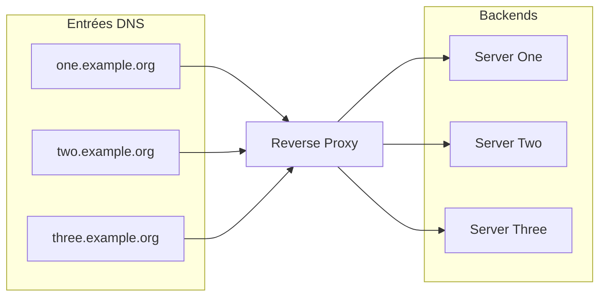

# Automatiser la création d'entrées DNS avec Kubernetes et Cloudflare

---

## 🖥️ Pourquoi faire ?

Automatiser la création d'entrées DNS, ça sonne bien, c'est stylé, mais ça sert à quoi concrètement ?

Quand on administre un cluster [Kubernetes](https://kubernetes.io), un des outils incontournables, c'est l'[ingress controller](https://kubernetes.io/docs/concepts/services-networking/ingress-controllers/). Il sert de [reverse proxy](https://fr.wikipedia.org/wiki/Proxy_inverse) et c'est donc lui qui traite les entrées [HTTP/S](https://fr.wikipedia.org/wiki/Hypertext_Transfer_Protocol) et vers quelles applications elles vont.




*Ok, donc si mon reverse proxy redirige le traffic vers les bonnes applications en fonction de l'entrée DNS, pourquoi pas faire un [wildcard](https://en.wikipedia.org/wiki/Wildcard_DNS_record) ?*

Très bonne question ! Qui à une réponse assez simple, la sécurité et le contrôle granulaire.

| Critère                      | Wildcard DNS                          | Création automatique d'entrées DNS                 |
|------------------------------|-------------------------------------|----------------------------------------------------|
| **Simplicité de configuration** | Très simple, une seule entrée pour tout | Nécessite un système pour créer chaque entrée individuellement |
| **Contrôle granulaire**        | Faible, tous les sous-domaines pointent au même endroit | Élevé, chaque sous-domaine est défini précisément |
| **Sécurité**                   | Risque de subdomain takeover et fuite de contrôle | Moins de risques, chaque entrée est volontairement créée |
| **Gestion des certificats SSL** | Un certificat wildcard est souvent nécessaire | Certificats individuels ou automatisés (ex: Let's Encrypt) |
| **Flexibilité**                | Faible, difficile de router différemment des sous-domaines | Très flexible, possible de router chaque sous-domaine vers un service différent |
| **Détection d'erreurs**        | Plus compliquée, sous-domaines mal orthographiés peuvent répondre | Plus facile, absence d'entrée signale une erreur ou un sous-domaine invalide |
| **Maintenance**                | Peu de maintenance nécessaire       | Nécessite un système de gestion et nettoyage des entrées |
| **Scalabilité**                | Très scalable (un seul enregistrement couvre tout) | Potentiellement moins scalable, dépend de la solution d'automatisation |

Dans mon cas, je veux limiter le nombre de requêtes inutiles et réduire mes vecteurs d'attaques.

En effet, quand on utilise un **wildcard DNS** avec un **Ingress Controller** comme [Nginx Ingress Controller](https://docs.nginx.com/nginx-ingress-controller/) ou même un [Gateway API](https://gateway-api.sigs.k8s.io/), si aucun service n'est routé pour `one.example.org` par exemple,
le contrôleur lui répond toujours ! Ce qui agrandit nos vecteurs d'attaque inutilement, et peut générer des requêtes supplémentaires de la part de bots ou de personnes malveillantes.

## 🔧 Le setup :

- Un cluster **Kubernernetes** : Ici, celui que j'utilise pour [Retake](https://retake.fr).
- Un nom de domaine : `retake.fr`
- [Cloudflare](https://cloudflare.com) : Comme DNS.
- **Ingress Nginx Controller** : En tant qu'**Ingress Controller**
- [External DNS](https://kubernetes-sigs.github.io/external-dns/latest/) : Comme outil magique pour gérer les entrées automatiquement

## ⚙️ La mise en place :

Allez, c'est partie.

D'abord, je tiens à préciser qu'**External DNS** supporte tous les DNS suivants : 

- [Google Cloud DNS](https://cloud.google.com/dns/docs/)
- [AWS Route 53](https://aws.amazon.com/route53/)
- [AWS Cloud Map](https://docs.aws.amazon.com/cloud-map/)
- [AzureDNS](https://azure.microsoft.com/en-us/services/dns)
- [Civo](https://www.civo.com)
- [CloudFlare](https://www.cloudflare.com/dns)
- [DigitalOcean](https://www.digitalocean.com/products/networking)
- [DNSimple](https://dnsimple.com/)
- [PowerDNS](https://www.powerdns.com/)
- [CoreDNS](https://coredns.io/)
- [Exoscale](https://www.exoscale.com/dns/)
- [Oracle Cloud Infrastructure DNS](https://docs.cloud.oracle.com/iaas/Content/DNS/Concepts/dnszonemanagement.htm)
- [Linode DNS](https://www.linode.com/docs/networking/dns/)
- [RFC2136](https://tools.ietf.org/html/rfc2136)
- [NS1](https://ns1.com/)
- [TransIP](https://www.transip.eu/domain-name/)
- [OVHcloud](https://www.ovhcloud.com)
- [Scaleway](https://www.scaleway.com)
- [Akamai Edge DNS](https://learn.akamai.com/en-us/products/cloud_security/edge_dns.html)
- [GoDaddy](https://www.godaddy.com)
- [Gandi](https://www.gandi.net)
- [IBM Cloud DNS](https://www.ibm.com/cloud/dns)
- [Plural](https://www.plural.sh/)
- [Pi-hole](https://pi-hole.net/)
- [Alibaba Cloud DNS](https://www.alibabacloud.com/help/en/dns)

> P.S. Cette liste provient de la [doc officiel](https://github.com/kubernetes-sigs/external-dns/blob/master/README.md)

Ça fait maintenant 2 ans que je bosse uniquement avec **Cloudflare**. C'est rapide, gratuit, l'API est très intuitive et les fonctionnalités gratuites sont très complètes.

Après s'être connecté à son compte **Cloudflare**, Dans `Profile` > `API Token` il faut créer un token avec la configuration suivante :


On le sauvegarde et on le met de côté pour le moment.

Maintenant place au déploiement d'**External DNS** :

D'abord, on crée un namespace :

```bash
kubectl create namespace external-dns
```

On crée un secret :

```bash
kubectl create secret -n external-dns generic cloudflare-api-key --from-literal=apiKey=<API_KEY> --from-literal=email=<EMAIL>
```

On ajoute le repository [helm](https://helm.sh) :

```bash
helm repo add external-dns https://kubernetes-sigs.github.io/external-dns/
helm repo update
```

On prépare nos valeurs :

```yaml
# values.yml
provider:
  name: cloudflare
env:
  - name: CF_API_KEY
    valueFrom:
      secretKeyRef:
        name: cloudflare-api-key
        key: apiKey
  - name: CF_API_EMAIL
    valueFrom:
      secretKeyRef:
        name: cloudflare-api-key
        key: email
```

Et on installe :

```bash
helm upgrade --install external-dns external-dns/external-dns --values values.yml -n external-dns
```

## 🎉 L'utilisation

Maintenant que tout est en place, on pourrait créer nos **ingress** et se reposer sur nos lauriers, pas vrai ?

Pas vrai du tout !

**External DNS** a été imaginé comme la majeure partie des projects **Kubernetes** officiels. C'est-à-dire pour fonctionner principalement sur un cloud provider. Alors oui, si on crée un **ingress** sur notre cluster, une entrée DNS sera créée, mais en tant que champ `A` qui pointera vers l'IP externe rattaché à notre **Ingress Controller**. Dans mon cas :

```
AME                                         TYPE           CLUSTER-IP     EXTERNAL-IP   PORT(S)                      AGE
service/ingress-nginx-controller             LoadBalancer   10.43.244.24   10.2.1.1      80:32553/TCP,443:32066/TCP   384d
```

Mais vu que `10.2.1.1` est une IP locale qui a été attachée par [Cilium](https://cilium.io), bah les requêtes **HTTP/S** qui passent par le champ `A` crée par **External DNS** vont répondre dans le vide.

Il va donc falloir forcer **External DNS** à créer nos entrées DNS avec notre IP publique.

Voici un exemple :

```yaml
# whoami.yml
apiVersion: networking.k8s.io/v1
kind: Ingress
metadata:
    name: whoami
    namespace: whoami
    annotations:
        external-dns.alpha.kubernetes.io/target: <IP Publique>
        cert-manager.io/cluster-issuer: letsencrypt
spec:
    tls:
        - hosts:
            - whoami.retake.fr
          secretName: whoami-cert-tls
    ingressClassName: nginx
    rules:
        - host: whoami.retake.fr
          http:
            paths:
                - path: /
                  pathType: Prefix
                  backend:
                    service:
                        name: whoami-svc
                        port:
                            number: 80
```

On applique :

```bash
kubectl apply -f whoami.yml
```

On verify sur le dashboard **Cloudflare** :


Et on valide par un `curl` :

```bash
curl http://whoami.retake.fr
```

```
IP: 127.0.0.1
IP: ::1
IP: [REDACTED]
IP: [REDACTED]::1026
IP: [REDACTED]:5866
RemoteAddr: [REDACTED]:56290
GET / HTTP/1.1
Host: whoami.retake.fr
User-Agent: curl/[REDACTED]
Accept: */*
X-Forwarded-For: [REDACTED]
X-Forwarded-Host: whoami.retake.fr
X-Forwarded-Port: 80
X-Forwarded-Proto: http
X-Forwarded-Scheme: http
X-Real-Ip: [REDACTED]
X-Request-Id: [REDACTED]
X-Scheme: http
```

Et PAF ! Création automatique d'entrée DNS réussi !

## 📚 Terminologie

| Terme                   | Définition                                                                                                    |
| ----------------------- | ------------------------------------------------------------------------------------------------------------- |
| **Ingress Controller**  | Composant Kubernetes qui gère le routage HTTP/S vers les services internes                                    |
| **Reverse Proxy**       | Serveur intermédiaire qui redirige les requêtes entrantes vers les bons services backend                      |
| **Wildcard DNS**        | Entrée DNS de type `*.example.org` qui capture tous les sous-domaines                                         |
| **Entrée DNS (Record)** | Enregistrement dans un DNS (de type A, CNAME, TXT, etc.) qui associe un nom de domaine à une IP ou autre info |
| **External DNS**        | Contrôleur Kubernetes qui synchronise les ressources (Ingress, Service, etc.) avec un provider DNS externe    |
| **Annotation**          | Métadonnée Kubernetes attachée à une ressource pour influencer son comportement                               |
| **Cert-manager**        | Outil pour automatiser la gestion de certificats SSL/TLS dans Kubernetes                                      |

## ✅ Conclusion

On a pu voir en très peu de temps comment ajouter une couche d'automatisation et de sécurité en créant des entrées DNS grâce à **External-DNS** et **Cloudflare**. Ce petit article m'a aussi permis de rencontrer et de résoudre un problème assez inattendu dont je parlerai dans un autre article et qui concerne une autre manière de sécuriser son infrastructure...