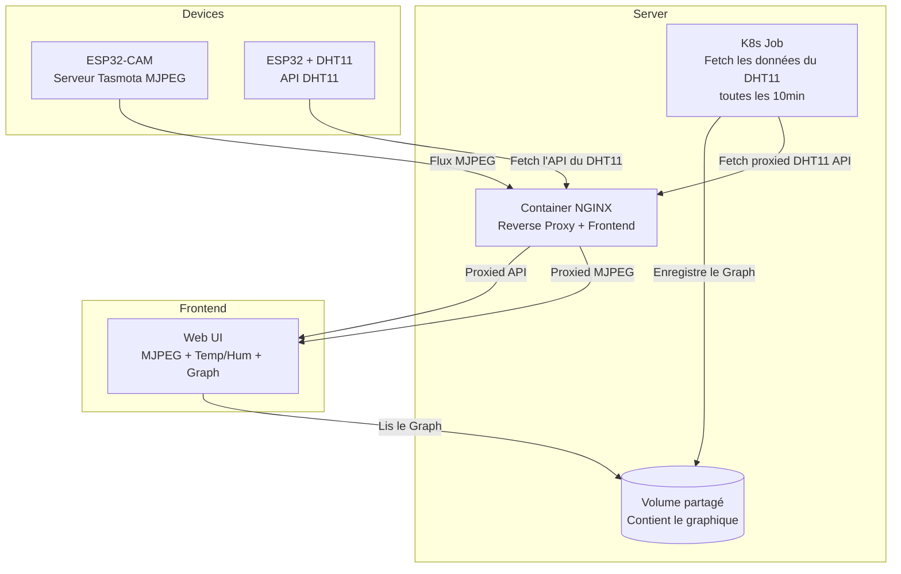

# 🌱 Monitorer des plantes avec Kubernetes

---

## 🛥️ Pourquoi des plantes et pourquoi encore du Kubernetes ?

Aujourd'hui je vais vous parler de mon entrée dans le monde de l'IoT en liant 2 passions : le DevOps et les plantes !

Et du coup, pourquoi faire ?

Je me suis récemment replongé dans le jardinage d’intérieur grâce à l’achat d’un [Lilo Connect](https://pretapousser.com/en/collections/jardins-interieur/la-gamme-lilo/), un mini-jardin autonome qui simplifie la culture des plantes à la maison. Comme je ne suis pas toujours dispo pour chouchouter mes petites pousses, j’ai décidé de mettre en place un petit setup [IoT (Internet of Things)](https://fr.wikipedia.org/wiki/Internet_des_objets) afin de pouvoir surveiller leur évolution à distance, en temps réel.

Et pourquoi **Kubernetes** ?

Pour 2 raisons :

1. Essayer une approche micro-services simple et basique(pas de MQTT et autre protocole)
2. Pour mettre en pratique les [Jobs](https://kubernetes.io/docs/concepts/workloads/controllers/job/).

## 📷 Le setup :

- Un **Lilo Connect**
- Un [ESP32 Cam](https://www.az-delivery.de/fr/products/esp32-cam-modul-esp32-wifi-bluetooth-modul-inklusive-kamera) avec [Tasmota](https://tasmota.github.io/docs/)
- Un capteur [DHT11](https://www.fruugo.fr/capteur-numerique-de-temperature-et-d%25E2%2580%2599humidite-dht11-module-dht11-pour-arduino-no76/p-61760594) pour la température et l'humidité
- Un [ESP32](https://www.az-delivery.de/fr/products/esp32-developmentboard) lié au DHT11
- Un cluster **Kubernetes**

Et en clair, ça donne ce beau diagramme :

Ça parait compliqué vu comme ça, mais vous allez voir, ça vas vite faire sense.